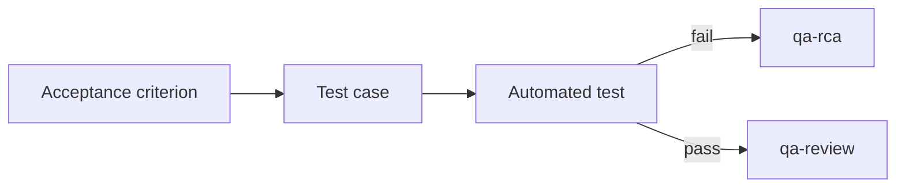

# TECH — QA Process Orchestration (architecture & contracts)

> Technical design for the twin npx packages described in **PRD.md**. Covers the monorepo layout,
> the shared-core + platform-adapter architecture, module contracts, the logical→platform artifact
> mapping, build/release, and testing strategy.
>
> Status: **Draft v0.1** · Targets Node ≥ 20, ESM. Delivery status & per-item tracking: **[`ROADMAP.md`](ROADMAP.md)**.

---

## 1. Monorepo layout

The repo becomes an npm-workspaces monorepo. Only the two leaf packages are published; `core` is a
private workspace bundled into each leaf at build time (so npx users never pull a third package).

```
ai-process-orchestration/
├── package.json                 # private root, "workspaces": ["packages/*"]
├── PRD.md / TECH.md
├── CLAUDE.md                    # updated: cli/ section → packages/*
├── packages/
│   ├── core/                    # @qa-orch/core — private, not published, bundled into leaves
│   │   └── src/{detect,wizard,scaffold,render,model,adapters,util}
│   ├── claude-qa-orchestrator/  # published npx package
│   └── copilot-qa-orchestrator/ # published npx package
├── vscode/auditskill/           # unchanged, separate artifact (Copilot config auditor)
└── knowledge-markdowns/         # reference only
```

The existing `cli/` package is **moved and split**: its platform-agnostic modules become
`packages/core`; its Claude-specific pieces (paths, skill template, CLI messages) become
`packages/claude-qa-orchestrator`. The current package (`claude-agent-scaffold` v0.1.0) is
**superseded** by `claude-qa-orchestrator` (QA domain). Empty `claude/` and `mcp/` are removed.

## 2. Two-phase architecture (preserved from the current CLI)

- **Phase 1 — installer (`npx <pkg> init`), 100% deterministic, NO LLM.** Detects the test stack,
  runs the `@clack/prompts` wizard (or `--yes` for CI), and writes the `context/` skeleton +
  guidelines + platform skill/prompt files with `{{PLACEHOLDER}}` markers, skip-if-exists. Does not
  read `ANTHROPIC_API_KEY` or call any model API.
- **Phase 2 — installed skill/prompt, LLM, runs inside the tool.** Interviews the QA engineer per
  skill and fills the remaining placeholders into finished artifacts.
  - Claude: `.claude/skills/<name>/SKILL.md` (frontmatter `allowed-tools`).
  - Copilot: `.github/prompts/<name>.prompt.md`, orchestrated by `.github/agents/qa-orchestrator.agent.md`.

## 3. Core modules & contracts (`packages/core`)

Reuses the current `cli/src` structure, extended. Key modules and their responsibilities:

- **`detect/`** — `detectStack(root): DetectedStack`. Per-language detectors (`node.ts`, `java.ts`,
  `python.ts`) extended with **test-stack detection** (see §8). Light parsing only: `JSON.parse` for
  `package.json`, substring/regex for `pom.xml` / `build.gradle`. Polyglot collects all, picks one
  primary by priority.
- **`wizard/`** — `runWizard(stack): Answers | null` (interactive) and `defaultAnswers(stack)`
  (`--yes`/CI). Questions reframed for QA (project type, automation framework, report language,
  autonomy level). Both seed from `labels.ts`.
- **`render.ts`** — `render(template, vars): string`. `{{KEY}}` substitution; **unknown placeholders
  left intact** for phase 2. Reused verbatim.
- **`scaffold/`** — `scaffold(input): WriteResult[]`. Writes the `context/` skeleton + guidelines
  (skip-if-exists) + `.scaffold/manifest.json` (phase-2 handoff state).
- **`model/`** — the **logical QA skill definitions**: each skill's name, description, procedure
  body, inputs/outputs, and which `context/` files it reads/writes — expressed once,
  platform-agnostic. This is where functional parity is guaranteed. Also holds the single-source
  registries the skills embed: `artifacts.ts` (`ARTIFACTS` + `tpl()` — runtime-artifact shape, R-059;
  now including the standalone `refinement` deliverable, R-066) and **`jira.ts`** (`mdToJira` + the
  `JIRA_CONVERSION_TABLE` embedded verbatim into the bug-report/refinement skills — the one
  Markdown→Jira transform, R-064, snapshot-tested).
- **`adapters/`** — the `PlatformAdapter` interface (see §5) that maps a logical artifact to a
  platform-specific path + frontmatter.
- **`util/fs.ts`** (`exists`, `readIfExists`, `firstExisting`), **`labels.ts`**,
  **`templates-path.ts`** (`templatesDir()` resolved from `import.meta.url`, works in `src/` and
  bundled `dist/`).

Each leaf package is `core` + one `PlatformAdapter` implementation + that platform's templates.

## 4. Platform mapping table (logical artifact → platform)

| Logical artifact | Claude | Copilot |
|---|---|---|
| Lean root config | `CLAUDE.md` | `.github/copilot-instructions.md` |
| Guideline | `.ai/guidelines/*.md` | `.github/instructions/*.instructions.md` |
| Skill (procedure) | `.claude/skills/<name>/SKILL.md` (`allowed-tools`) | `.github/prompts/<name>.prompt.md` |
| Orchestrator/agent | skills + `CLAUDE.md` | `.github/agents/qa-orchestrator.agent.md` (`handoffs[]`) |
| MCP | `.mcp.json` / settings | `.vscode/mcp.json` |
| Quality gates / hooks | `.claude/settings.json` (PostToolUse) | `.github/instructions` + documented manual gate |
| System of record | `context/**` | `context/**` (identical) |

## 5. Skill model & `PlatformAdapter`

A logical skill from `core/model` renders to different surfaces:

- **Claude** → `.claude/skills/<name>/SKILL.md` with YAML frontmatter incl. `model` (the suggested
  tier) and `allowed-tools`.
- **Copilot** → `.github/prompts/<name>.prompt.md`; cross-skill choreography is expressed via the
  orchestrator agent's `handoffs[]` (frontmatter shape proven by
  `vscode/auditskill/.github/agents/audit-agents.agent.md`: `description`, `model`, `tools[]`,
  `agents[]`, `user-invokable`, `argument-hint`, `handoffs[{label,agent,prompt,send}]`, `target`).
  Copilot prompts carry no per-prompt model field, so `suggestedModel` is documentation-only there.

```ts
interface LogicalSkill {
  name: string;                 // e.g. "qa-ticket-review"
  description: string;
  readOnly: boolean;            // read-only skills get no write tools in the allowlist
  bucket: "backbone" | "design" | "automation" | "analysis";
  suggestedModel: "opus" | "sonnet" | "haiku"; // matched to cognitive load; -> Claude `model:` frontmatter
  reads: string[];              // context/ paths it consumes
  writes: string[];             // context/ paths it produces
  body: string;                 // procedure text (may contain {{PLACEHOLDER}} for phase 2)
}

interface PlatformAdapter {
  id: "claude" | "copilot";
  rootConfigPath(): string;                         // CLAUDE.md | .github/copilot-instructions.md
  guidelinePath(name: string): string;
  renderSkill(skill: LogicalSkill, vars): WriteFile[]; // -> SKILL.md | prompt.md (+ agent handoff)
  mcpPath(): string;                                // .mcp.json | .vscode/mcp.json
  hooks(vars): WriteFile[];                          // .claude/settings.json | [] (manual gate doc)
}
```

### Skill × model × tooling matrix (R-014)

The single authoritative view of the suite: each skill's bucket, read/write mode, **suggested model
tier**, and the MCP/tooling it leans on. **Naming standard (R-017): every skill is `qa-<name>`** — a
uniform prefix so the suite is unambiguous in the tool's skill/prompt picker and never collides with a
target repo's own skills. `suggestedModel` is defined once on the `LogicalSkill`
(`core/src/model/skills.ts`) and rendered into Claude `SKILL.md` `model:` frontmatter; on Copilot it is
documentation-only (prompts have no model field). Heuristic: **`opus`** for heavy reasoning (risk
analysis, case derivation, root cause, coverage judgment), **`haiku`** for mechanical steps (id +
file creation, archive moves), **`sonnet`** for the balanced middle.

| Skill | Bucket | Mode | Suggested model | Why | MCP / tooling |
|---|---|---|---|---|---|
| `qa-init` | backbone | write | `sonnet` | guided interview + fill foundation | reads `manifest.json` |
| `qa-guidelines` | backbone | write | `sonnet` | fill guideline placeholders, grounded in code | reads `manifest.json` |
| `qa-new` | backbone | write | `haiku` | mechanical: stable id + `work.md` | — |
| `qa-plan` | backbone | write | `opus` | risk/strategy reasoning | — |
| `qa-implement` | backbone | write | `sonnet` | orchestration / delegation | result servers (indirect) |
| `qa-review` | backbone | read | `opus` | coverage + traceability judgment | result servers |
| `qa-archive` | backbone | write | `haiku` | mechanical: append + move | — |
| `qa-ticket-review` | design | read | `opus` | ambiguity + risk analysis | `atlassian` (opt-in) |
| `qa-test-plan` | design | write | `sonnet` | strategy-level doc | — |
| `qa-test-case-design` | design | write | `opus` | derive negative/boundary cases | — |
| `qa-automation-bootstrapper` | automation | write | `sonnet` | framework setup + wiring | result servers |
| `qa-test-automate` | automation | write | `opus` | author robust test code | result servers |
| `qa-playwright-cli` | automation | write | `sonnet` | drive Playwright CLI (codegen/trace/snapshots) | Playwright CLI, browser MCP (opt-in) |
| `qa-ci-pipeline` | automation | write | `sonnet` | generate/audit CI that runs the framework + publishes result dirs + runs `doctor` as a PR gate (R-051) | reads `tools.md` + `manifest.json`, targets result-MCP dirs |
| `qa-performance` | automation | write | `sonnet` | generate/audit a JMeter plan enforcing NFRs (p95/p99/throughput/error-rate), run headless | `jmeter-results` MCP (when JMeter detected) |
| `qa-rca` | analysis | read | `opus` | root-cause reasoning | result servers |
| `qa-test-data-gen` | analysis | write | `sonnet` | reusable schema-valid factories/fixtures | stack-aware (faker/factory_boy/datafaker) |
| `qa-gardening` | analysis | read | `sonnet` | scan + prioritize drift | reads `doctor` output |
| `qa-bug-report` | analysis | write | `sonnet` | structured defect report from evidence | result servers, `atlassian` (opt-in) |
| `qa-reverse-engineer` | analysis | write | `opus` | reverse-engineer code → project docs | reads app source (read-only on code) |
| `qa-coverage-gap` | analysis | read | `opus` | AC ↔ case ↔ test traceability + uncovered criteria | result servers |
| `qa-metrics` | analysis | read | `sonnet` | pass/fail/flake + coverage digest across runs | result servers (+ Allure history) |
| `qa-framework-analyze` | analysis | write | `opus` | reverse-engineer the test framework → `framework-architecture.md` (P3) | reads framework code (read-only on code) |
| `qa-knowledge` | analysis | write | `opus` | synthesize durable P2 knowledge from Jira/Confluence → `context/knowledge/` | `atlassian` / `xray` / `markitdown` (opt-in, R-065) |
| `qa-doc-critic` | analysis | read | `opus` | per-document semantic gate vs the documentation standard + grounding + assumptions | reads `context/` docs |

"Result servers" = the stack-appropriate read-only MCP server wired in phase 1: `playwright-results`,
`pytest-results`, or `jvm-results` (see `core/src/model/mcp.ts`). When detection finds **Allure**
(`DetectedStack.observability`), its `allure-results` + `allure-report` (durable cross-run history) dirs
are appended to that server — so `qa-metrics` reads flakiness/trends, not just the latest run (R-012).

**Orchestration via `## Next` (R-020).** Every skill body ends with a `## Next` section recommending
the downstream skill(s) — the agent-orchestration graph is encoded in the skills themselves, not in a
separate router. `qa-reverse-engineer` writes durable system docs to `context/reference/`; `qa-bug-report`
closes the `qa-rca` → defect gap; `qa-coverage-gap` (R-022) maps AC ↔ case ↔ test and reports uncovered
criteria, feeding `qa-test-case-design` / `qa-test-automate`. `qa-ci-pipeline` (R-027) extends `qa-test-automate`'s
`## Next`: once tests pass locally, it generates/audits a CI pipeline (GitHub Actions / GitLab CI / Azure
Pipelines) that runs the framework and publishes the result-MCP dirs, so `qa-metrics` / `qa-rca` read CI
outcomes the same way they read local runs — the test → report → legibility loop closed at the CI boundary.
**R-051** extends that pipeline with a second gate: the same CI job runs the deterministic, read-only
`doctor` validator (`npx <qa-orchestrator> doctor`) as a **pull-request gate**, so a drifted or broken
`context/` scaffold fails the build the same way a failing test does — delivering the
`documentation-as-code` (R-028) promise ("docs kept in sync by CI") at the CI boundary; the skill
optionally adds `update --dry-run` to surface upstream template drift, and its audit mode checks an
existing pipeline runs the gate. No extra dependency: `doctor` ships in the orchestrator package run via `npx`.

The leaf CLI = parse args → `detectStack` → `runWizard`/`defaultAnswers` → for each `LogicalSkill`
call `adapter.renderSkill` → `scaffold` `context/` + guidelines + adapter outputs.

## 6. Context system of record (platform-agnostic)

```
context/
├── foundation/   test-strategy.md, test-plan.md, tools.md, test-framework.md (R-067), framework-architecture.md (P3, R-071), environments.md, lessons.md, tech-debt-tracker.md, repo-map.md
├── changes/<work-id>/   work.md, plan.md (3-perspective, R-062), cases.md (detailed, R-063), automation.md, bug-report.md + bug-report.jira (R-064), performance.md  — runtime artifacts carry status/work-id + built-on: provenance (R-069/R-070)
├── refinements/   <YYYY-MM-DD>-<KEY>-<slug>.md + .jira  (standalone ticket refinements, qa-ticket-review, R-066)  — P2
├── knowledge/   <topic>.md  (durable domain knowledge from Jira/Confluence, qa-knowledge, R-072)  — P2
├── archive/<work-id>/   (read-only)
└── reference/   system-overview.md (QA test-surface lens R-068 + API inventory/completeness R-074) + reverse-engineered C4 docs (qa-reverse-engineer)  — P1
```

**Documentation pillars (R-069 → R-074).** The three authoring outputs rest on **pillars of generated
documentation**, each with an on-disk home so `doctor` reads a pillar's type from a path: **P1** =
`reference/` (app source, `qa-reverse-engineer`), **P2** = `knowledge/` + `refinements/`
(Jira/Confluence, `qa-knowledge` / `qa-ticket-review`), **P3** = `foundation/framework-architecture.md`
(test-framework code, `qa-framework-analyze`). Every durable doc conforms to the `documentation`
meta-standard (R-069: frontmatter `title`/`version`/`last-updated`/`owner-skill`/`status`, single H1,
when-to-use lede, length discipline — `doctor`-checked, born compliant). A runtime artifact records the
pillars it rests on in `built-on:` frontmatter (R-070), a *horizontal* provenance dimension orthogonal to
the vertical `AC<n>`→`Traces to:`→`Covers:` chain; `doctor` warns on a missing required pillar.

- The lean root config is an **index**, not a repository; skills fetch from `context/` just-in-time
  (hierarchical / pull-based retrieval, not upfront injection). Critical, non-negotiable rules live in
  the lean root so they **survive context compaction**.
- `foundation/` is edited in place; per-work-item docs live under `changes/<work-id>/`; completed
  items move to `archive/`.
- **Large outputs are offloaded to files** under `changes/<work-id>/` and referenced by path, rather
  than pasted inline — keeps the working context bounded.
- `context/` docs are **machine-readable and cross-linked** (relative links between foundation docs and
  work-items); a deterministic validator (see §11) can check link/section integrity outside the agent loop.
- **Work-item IDs are deterministic hashes** so re-runs stay stable — mirrors the `F-###` / `OPT-###`
  determinism in `vscode/auditskill`.

## 7. Build & release

- **tsup** per leaf package: bundles `core` (via workspace import) into a single ESM `dist/index.js`
  with a `#!/usr/bin/env node` banner, and an `onSuccess` step that copies `src/templates` →
  `dist/templates` (same pattern as the current `cli/tsup.config.ts`). Keep that copy step.
- Each leaf has its own `package.json` `version`, `bin`, `files: ["dist", "README.md"]`, `engines.node >= 20`,
  and `prepublishOnly: typecheck && test && build`. **Independent versioning and release.**
- `@clack/prompts` is the only runtime dep (carried from the current CLI); shared via core, bundled.
- npx smoke test in CI: run each `dist/index.js init --root <tmp> --yes` and assert the output tree.

## 8. Detection details (test stacks)

| Stack | Manifest / marker |
|---|---|
| Playwright (TS/JS) | `@playwright/test` in `package.json`; `playwright.config.{ts,js,mjs}` |
| Playwright (Java) | `com.microsoft.playwright` in `pom.xml` / `build.gradle(.kts)` |
| RestAssured (Java) | `io.rest-assured` in `pom.xml` / `build.gradle(.kts)` |
| JVM runner | JUnit 5 (`org.junit.jupiter`) / TestNG (`org.testng`); Maven vs Gradle (already partly in `detect/java.ts`) |

Detection feeds wizard defaults (chosen automation framework, primary language). The iron QA rule
(carried from the current templates) always requires tests in the detected/chosen `{{TEST_FRAMEWORK}}`.

## 9. Testing strategy

- **vitest** in `core` and each leaf (reuse the current `tempProject()` fixture pattern).
- `detect.test.ts` — extended with Playwright TS/Java and RestAssured fixtures + polyglot priority.
- `render.test.ts` — unchanged contract (known replaced, unknown preserved).
- `scaffold.test.ts` — `context/` tree, manifest validity, idempotency, iron-QA-rule injection.
- **Per-adapter snapshot tests** — render the full skill suite for each platform and assert the
  generated tree; a **parity test** asserts both platforms emit the same set of logical skills and an
  identical `context/` skeleton (only paths/frontmatter differ).

## 10. Compatibility & invariants

- Node ≥ 20, ESM throughout.
- **Never overwrite**: scaffolding is skip-if-exists; regeneration requires deleting `context/` / config.
- Phase 1 never uses an LLM or `ANTHROPIC_API_KEY`.
- Functional parity between packages is an invariant enforced by the parity snapshot test.
- This repo's user-facing skill strings stay PL (per `CLAUDE.md`); package code, identifiers, JSON
  keys, and these design docs are EN.

## 11. Harness-engineering alignment

What we scaffold **is a harness** — the execution environment around the QA agent (what it can read,
which tools it calls, how it validates, when it stops). The patterns below come from OpenAI's
"Harness engineering" (Codex) report and the 10xDevs-3 context-scaling lesson; both say the same thing:
*the harness is the car, the model is the engine.* Concrete commitments for our packages:

- **Map, not a thousand-page manual.** Lean root config (~100 lines) is a **table of contents**;
  knowledge lives in `context/` and is pulled just-in-time (progressive disclosure). This directly
  counters the four failure modes of a monolithic root file: context is scarce, "everything important"
  ⇒ nothing is, instant rot, and un-verifiability.
- **"What's not in context doesn't exist."** QA knowledge stuck in Jira/Slack/people's heads is
  invisible to the agent. The scaffolded `context/foundation/` (test-strategy, test-plan, tools,
  environments, lessons) is the place to **encode** that knowledge as versioned repo artifacts.
- **Plans as first-class artifacts.** `context/changes/<id>/` (active) and `context/archive/` (done)
  mirror Codex's `exec-plans/active|completed`. Add `context/foundation/tech-debt-tracker.md` (or
  `lessons.md`) as a versioned, agent-readable backlog of test debt / known flaky areas / RCA history.
- **Single source of artifact shape (R-059).** The shape of those runtime artifacts is not left to prose
  in each producing skill — it lives once in the **artifact template registry**
  (`core/src/model/artifacts.ts`, `ARTIFACTS: ArtifactTemplate[]` + `tpl(name)`), the runtime-artifact
  analog of `GUIDELINES`/`FOUNDATION` for the skeleton. Each entry carries the canonical seeded `template`,
  the `requiredSections` a validator checks, an optional `traceField`, and (R-070) an optional
  `requiredPillars`. The producing skills (`qa-new`, `qa-plan`, `qa-test-case-design`, `qa-test-automate`,
  `qa-performance`, `qa-bug-report`, `qa-ticket-review`, and `qa-knowledge`) embed their template via
  `tpl(name)` inside a fenced `## Template` section, so the shape is single-sourced and renders identically
  for both adapters (parity holds automatically; the doc generator is unaffected — it reads only
  When-to-use/Procedure/Next). The registry formalizes **parseable trace markers** — `work.md` ids every
  acceptance criterion `AC<n>` and seeds frontmatter `status: in-progress`, `cases.md` carries
  `Traces to: AC<n>`, `automation.md` carries `Covers: TC<n>` — so the iron QA rule (AC ↔ case ↔ test) can
  be checked on real files rather than asserted as prose. **R-070** adds a horizontal `built-on:` frontmatter
  provenance dimension + `requiredPillars` per artifact, and **R-069** the per-tier frontmatter/section
  contract (`docTier`, `DURABLE_DOC_FRONTMATTER`); `doctor` enforces both (`DOCSTD:*`, `BUILTON:*`). This is
  the foundation the persisted analyses (R-060) and the `doctor` work-item validator + `status:` gating
  (R-061) both build on.
- **Invariants over micromanagement.** Enforce a small set of inviolable rules, not implementation
  detail: the iron QA rule (tests in the detected framework), every test case traces to an acceptance
  criterion, every automated test carries a stable ID, deterministic work-item IDs. Leave *how* to the agent.
- **Grounding / anti-hallucination (R-029).** A second load-bearing rule in the lean root config
  (alongside the iron QA rule, so it survives compaction): every claim cites a real, checkable artifact
  — `file:line`, a ticket id, or result-MCP output — and uncertainty is flagged, never papered over with
  an invented path/API/result. A "passing" test the agent didn't observe pass is not evidence. It ships
  as the **`grounding`** guideline (`GUIDELINES` in `core/src/model/context.ts`), is referenced by the
  claim-producing skill procedures (`qa-rca`, `qa-bug-report`, `qa-reverse-engineer`, `qa-coverage-gap`,
  `qa-metrics`, `qa-review`, `qa-ticket-review`), and `doctor` enforces both its presence in the root
  config (`GROUNDING:missing`) and its content contract in the guideline (`GROUNDING:contract`) — the
  same mechanical-enforcement shape as the iron-QA-rule and docs-as-code checks. This makes result
  legibility *honest*: the agent must read the artifact, not recall a plausible value.
- **Read before you write (R-033).** A standing procedural rule in the lean root config: before any
  **write** skill changes a file, it reads the guidelines/standards bearing on the task (`qa-conventions`,
  `test-naming`, and whichever of `spec-driven-development` / `grounding` / `documentation-as-code` /
  `diagram-conventions` apply). It composes with grounding (read, don't recall) and docs-as-code, so work
  conforms *by construction* instead of being corrected after. The rule lives once in
  `rootConfigMarkdown` and is injected at the top of every write skill's procedure (`READ_FIRST_STEP` in
  `core/src/model/skills.ts`; read-only skills are left untouched since they change nothing). `doctor`
  checks the rule is present (`READFIRST:missing`) — a **warn**, not an error: its absence is a
  process-quality gap, not a correctness defect, so unlike the iron-QA/grounding rules it won't fail CI.
- **Mechanical enforcement + remediation-carrying errors.** A deterministic validator (the QA analog
  of `vscode/auditskill`) checks structure, cross-links, and placeholders **outside the agent loop**;
  its findings carry fix instructions so they can be fed back into agent context. **Shipped** as the
  **`doctor`** command (`core/src/doctor/index.ts`, `runDoctor`; exits non-zero on errors) and the
  recurring read-only **`qa-gardening`** skill (shipped R-004) that folds in `doctor`'s findings and hands
  each targeted fix to the right write skill. **Extended in R-031:** `doctor --fix` adds optional,
  still-deterministic *remediation* for broken relative links (`core/src/doctor/index.ts`, `fixLinks`) —
  dry-run preview by default, `--write` to apply — repairing unique-basename relocations and
  disambiguating Playwright report/trace links (`playwright-report/index.html`,
  `test-results/**/trace.zip`) surfaced by `qa-playwright-cli` / the result MCP; anything not provably
  unique is left as a finding, mirroring auditskill's `apply-step` dry-run/write contract.
- **Migration when `core` changes (`update`).** ✅ **Shipped (R-034).** A third deterministic, no-LLM CLI
  verb (`core/src/update/index.ts`, `runUpdate`; sibling of `init`/`doctor`) closes the maintenance gap
  where new skills, guidelines, MCP wiring, and root-config rules added to `core` never reach repos that
  ran an older installer. It re-renders the current templates (`scaffold/index.ts:scaffoldFiles`, with
  the manifest's saved `stack`/`choices` and original `generatedAt`, so unchanged templates render
  byte-identical) and classifies each expected file: `create` (absent → additive write), `update`
  (present **and provably pristine** — its on-disk sha256 matches the baseline recorded in
  `manifest.files`, so the user never touched it → safe refresh to the new template), `drift`
  (user-edited, filled-in phase-2 content, or no recorded baseline → **reported, never clobbered**),
  `unchanged`, and `orphan` (recorded in the baseline but no longer scaffolded → **reported, never
  deleted**). Dry-run by default; `--write` applies `create`+`update` and rewrites the manifest baseline
  (`updatedAt` + refreshed `files` hashes). The pristine baseline is the load-bearing idea: `scaffold`
  now records a sha256 of every file's canonical rendered content in the (backward-compatible, still
  `schemaVersion: 1`) manifest; manifests written before R-034 lack it and `update` degrades safely to
  additive-only. Mirrors the `doctor --fix` / auditskill `apply-step` dry-run/write contract.
  **Version-aware (R-038, v0.28.0).** The manifest also records `toolVersion` — the package version
  (`claude`/`copilot-qa-orchestrator`, sourced from the leaf's `package.json` and threaded through
  `CliMeta.version`) that last wrote the scaffold (set by `init`, refreshed by `update --write`).
  `update` compares it against the running tool (`compareToolVersions`, a dependency-free numeric
  semver compare in `core/src/update/index.ts`) and surfaces a `VersionInfo`
  (`scaffolded`/`running`/`direction`: `same`/`upgrade`/`downgrade`/`unknown`): the CLI prints
  `scaffolded X → running Y` and **warns on a downgrade** (running an older tool would revert newer
  templates). Pre-R-038 manifests have no `toolVersion` and report `unknown` while behaving exactly as
  before. This is the foundation for the rest of the version-aware-`update` epic: the changelog (R-042)
  computes its delta from `toolVersion`, and the 3-way merge (R-039 → R-041) needs to know *what
  changed between versions* before it can merge.
  **Baseline stored as content (R-039, v0.29.0).** A 3-way merge needs the *base* — the old rendered
  template — not just a fingerprint, so each `manifest.files` entry graduates from a bare sha256 string
  to a self-contained `FileBaseline` object (`{ hash, content }`) recording the full canonical rendered
  content (`scaffold/index.ts:fileBaseline`, written by both `scaffold` and `update --write`). `update`
  now proves pristineness by a direct **content** comparison (`onDisk === base.content`) and keeps the
  base on hand for the upcoming merge — all without a git dependency. The shape is read back through a
  small normalizer (`update/index.ts:readBaseline`) that tolerates all three historical forms: the R-039+
  object, the R-034..R-038 hash-only string (pristineness still proven by sha256, no merge base), and the
  pre-R-034 absent entry (additive-only). On `drift` the prior entry is preserved **verbatim** (a legacy
  hash stays a hash; a content base stays content) so the file keeps reporting drift until resolved. The
  trade-off is a larger manifest (the rendered base of every scaffolded file, ~85 KB for the default
  Playwright-TS scaffold), accepted deliberately to keep the merge base self-contained. *Prerequisite for
  the R-040 3-way merge engine.*
  **3-way merge engine (R-040, v0.30.0).** With the base content on hand, `update` stops treating every
  user-edited file as untouchable. When a file is `drift` **and** the template changed since the recorded
  base, it runs a self-contained, dependency-free line-based **diff3** (`core/src/update/merge.ts`,
  `merge3`) that replays the upstream delta (base → current template) onto the local edits: disjoint
  hunks auto-apply, and only edits that touch the *same* region and differ remain. Two new actions
  refine `drift`: **`merge`** (clean — applied on `--write`, the manifest base advancing to the current
  template so the next run is reconciled) and **`conflict`** (genuine clash — reported with conflict
  markers but **never written** in R-040; R-041 adds interactive resolution). Files with no recorded base
  content (pre-R-039 hash-only / pre-R-034 absent) or no upstream change fall back to classic `drift`,
  untouched. The merge is dependency-free on principle (the repo keeps `core` lean — only
  `@clack/prompts` — and R-038 already hand-rolled its semver compare), with a deliberate **safety bias**:
  touching-but-disjoint edits stay independent (both apply), while any genuine overlap is reported as a
  conflict rather than guessed — a false conflict leaves the file untouched (harmless), whereas a wrong
  auto-merge would not be.
  **Interactive conflict resolution (R-041, v0.31.0).** A `conflict` no longer means "edit it by hand."
  The merge engine now also returns the merge as ordered **regions** (`MergeRegion[]` — stable runs plus
  conflict regions carrying all three sides), and `update` surfaces them on each `conflict` item
  (`UpdateItem.conflict = { regions, count }`). On `update --write` in an interactive terminal, the CLI
  hands those conflicts to an `@clack/prompts` form (`core/src/update/resolve.ts`, `resolveConflicts` —
  the QA analog of the `init` wizard, **deterministic, no LLM**): for each conflict region the user picks
  **keep mine** / **take theirs** / **show diff** (mine / base / theirs, then re-prompt) / **skip this
  file**. Resolved files are rebuilt from the choices (`merge.ts:applyResolutions`, marker-free) and fed
  back as `runUpdate({ write: true, resolutions })`, which writes them and advances the base to the
  template (reconciled, exactly like a clean `merge`); skipped files stay reported as `conflict` and
  untouched. To keep this clean, `update --write` runs **two passes** — classify (dry-run) to discover
  conflicts, prompt, then apply with the collected resolutions — and the interactive form only fires on a
  TTY, so non-interactive/CI runs behave exactly as in R-040 (conflicts reported, never written).
  **Template changelog (R-042, v0.32.0).** `update` now reports the **upstream template delta** between
  the scaffolded and running versions, so the user sees *what changed* before deciding what to apply.
  `computeChangelog` (`core/src/update/changelog.ts`) diffs the recorded manifest baseline against the
  current rendered templates — the same vars `runUpdate` builds, so unchanged templates render identically
  and never show as spurious changes — and emits `UpdateReport.changelog` (`{ fromVersion, toVersion,
  entries }`). It is **template-side and independent of the user's on-disk edits**: a file the user deleted
  or rewrote still appears as `changed` iff the *template* changed (distinct from `update`'s per-file repo
  actions, which describe "what happens to *my* repo"). Each entry is `added` (no recorded base), `changed`
  (base content/hash differs from the current template), or `removed` (in the baseline, no longer
  scaffolded), and is classified `skill`/`guideline`/`file` by a path-derived classifier built from the
  adapter's *own* skill/guideline path shapes (a sentinel-name split of `guidelineRel`/`renderSkill`), so it
  also names *removed* skills that are no longer in `SKILLS`. The `manifest.toolVersion` anchor (R-038)
  labels the window (`fromVersion → toVersion`); after `update --write` advances the baseline the next run's
  changelog is empty, and nothing is invented — every entry traces to a real base→template difference.
  Pre-R-034 manifests (no baseline) yield no changelog (`undefined`). The CLI prints it as a grouped
  "Upstream template delta X → Y" note before the repo-side plan.
  **File-by-file walk (R-043, v0.33.0).** `update --interactive` (`-i`) steps through each change one file
  at a time — **apply / skip / show diff** — instead of the bulk `--write`, for reviewing a large
  migration. The classifier now attaches a `preview` (`{ before?, after }`) to every actionable
  `create`/`update`/`merge` item (`after` = the proposed content; `before` = the current on-disk content,
  omitted for a new file), so the walk can render a compact unified line diff (`merge.ts:diffLines`, one
  `@@`-headed hunk per changed region, no context). The CLI classifies first (dry-run), then `walkChanges`
  (`core/src/update/resolve.ts`, alongside the R-041 conflict form) prompts apply/skip/diff per
  create/update/merge **and** resolves conflicts region-by-region (reusing `resolveFile`) in one
  document-order pass; the selection feeds `runUpdate({ write: true, apply, resolutions })`. The new
  `apply?: string[]` option **signals interactive mode by its presence** (even when empty): only listed
  files are written, every other actionable file is reported `skipped: true` and **left untouched with its
  baseline preserved**, so a later run offers it again. Conflicts stay gated by `resolutions`, never by
  `apply`. When `apply` is absent, `update` writes everything in bulk exactly as before; `--interactive`
  requires a TTY and otherwise falls back to a dry-run preview, so CI behavior is unchanged. *The
  version-aware-`update` epic (R-038→R-043) is complete.*
- **Make test results legible to the agent.** ✅ **Shipped.** The QA analog of Codex's Chrome DevTools /
  observability wiring: phase 1 provisions a read-only `playwright-results` filesystem **MCP server**
  (`.mcp.json` / `.vscode/mcp.json`) over the Playwright HTML report + traces (`core/src/model/mcp.ts`,
  `resultServers`), so `qa-rca` and `qa-test-automate` read outcomes directly instead of relying on copy-paste.
  Both adapters share the server map; only the JSON envelope differs (`mcpServers` vs `servers`). **Extended
  in R-012:** detection of **Allure** (`DetectedStack.observability`) appends its durable cross-run history
  (`allure-report/history`) + results dirs to the result server, lifting legibility past a single static
  report dir; the read-only **`qa-metrics`** skill then aggregates pass/fail/flakiness + criterion-coverage
  across runs into a digest. **R-023** adds an opt-in (default off) official `@playwright/mcp` **browser**
  server (`browserServers` in `core/src/model/mcp.ts`) for *interactive* exploration in
  `qa-test-case-design` / `qa-rca` — distinct from the read-only result servers, which only read static
  artifacts. No secrets, so it renders identically on both platforms (only the envelope key differs).
- **Read-only vs. write skills.** Each `LogicalSkill` is annotated read-only (`qa-review`, `qa-rca`,
  `qa-gardening`, `qa-coverage-gap`, `qa-metrics`) or write (`qa-test-case-design`, `qa-test-automate`,
  `qa-automation-bootstrapper`, `qa-ticket-review` — flipped to write in R-066 to produce the refinement
  deliverable, …); the adapter encodes this as Claude `allowed-tools` and as Copilot agent
  tool allowlists — schema-level filtering, not prose. Each skill also carries a `suggestedModel` tier
  (R-014), rendered as Claude `model:` frontmatter — see the matrix in §5.
- **Content fetch via MCP (R-065).** Two opt-in servers wired alongside `atlassian` (R-009) by
  `fetchServers` in `core/src/model/mcp.ts`, with `${VAR}` secret indirection and the platform-correct
  envelope: **`xray`** (Jira test issue types) and **`markitdown`** (binary attachment → Markdown, local
  path only). The **`mcp-content-fetch`** guideline codifies the load-bearing **download → verify →
  convert → read** ordering and source priority (Jira+Xray > Jira > Confluence > attachments); skipping a
  step is the #1 cause of hallucinated summaries. `qa-ticket-review` / `qa-bug-report` produce
  **dual output** (canonical Markdown + a paste-ready `.jira`) via the one `model/jira.ts` transform (R-064).
- **Compaction survival.** The handful of inviolable rules live in the lean root so they persist when
  the conversation is compacted over long QA sessions.
- **Documentation pillars (✅ shipped v0.47.0–v0.52.0, R-069→R-074).** The authoring chain (plan → cases → implementation)
  rests on **three pillars of generated documentation**: **P1** from the application source
  (`context/reference/`, `qa-reverse-engineer` — shipped), **P2** from Jira/Confluence
  (`context/knowledge/` + `refinements/`, `qa-knowledge`, R-072), and **P3** from the test-framework code
  (`context/foundation/framework-architecture.md`, `qa-framework-analyze`, R-071) so authored test code
  matches the framework architecture *as documented*. Each generated doc conforms to a **meta documentation
  standard** — a `documentation` guideline that *references* (not duplicates) `grounding`/`diagram-conventions`/
  `documentation-as-code`, plus a machine frontmatter/section contract in `artifacts.ts` that `doctor`
  enforces (R-069, the same rule-plus-check pattern as `ENVMGMT:contract`/`GROUNDING:contract`). A horizontal
  **`built-on:` provenance** field (R-070) records which pillar docs an artifact rests on — orthogonal to the
  vertical `AC<n>`→`Traces to:`→`Covers:` chain — `doctor` warns when a skill's required pillars are missing,
  and the hard gate at `status: ready` folds into the R-061 work-item validator. The §5 matrix, the §6
  context tree, and the §12.1 guideline table carry the shipped rows; `qa-doc-critic` (R-073) is the
  read-only per-document semantic gate and R-074 closes P1 with an API/endpoint inventory + completeness
  check. The design record is `docs/design/documentation-pillars-R069-074.md`.
- **Multi-repo workspace — scan-root / write-root split (R-083 → R-088, v0.54.0–v0.59.0).** The harness now
  scopes to a **parent folder holding several repos**: one **test repo** (the only writable area — where the
  whole `context/` + skill suite + manifest land) and read-only **developer repos** (application source).
  `init --root <parent>` enumerates the sub-repos (`detect/repo-map.ts:enumerateRepos`), the wizard / `--yes`
  picks the test repo (`chooseTestRepo`), and the single seam in `scaffold` — `join(root, rel)` — becomes
  `join(writeRoot, rel)` with a new `ScaffoldInput.writeRoot?`; the adapter interface is untouched, so parity
  is structurally safe. The manifest gains an additive `workspace { testRepo, devRepos, workspaceFile }` (still
  `schemaVersion: 1`, parent-relative names). Source legibility across the workspace is the `DEVELOPER_REPOS`
  phase-1 var (an inline-`../<repo>/` section in `repo-map.md`/`system-overview.md`, the source-reading skills
  grounding at `../<dev>/file:line`). The "never write to a dev repo" invariant is enforced in **four layers**:
  the load-bearing `MULTI_REPO_RULE` (root config + every write skill, the same shape as the iron/grounding
  rules), the `multi-repo-boundaries` guideline, `doctor`'s `MULTIREPO:contract` + `MULTIREPO:leak:<repo>`
  checks (the out-of-loop gate, composing with the R-051 CI gate), and the generated `.code-workspace`'s
  `files.readonlyInclude` (the native editor pin) — persuasion + a native guardrail + a mechanical check, no
  single one a hard sandbox. **Backward-compatibility invariant:** a single-repo `--root` (no sibling repos)
  produces byte-identical output — no `workspace` block, no `.code-workspace`, no boundary rule — so every var
  renders to "" and the parity test stays green unchanged. `doctor`/`update` run pointed at the test repo and
  read topology from the co-located manifest. The design record is `docs/design/multi-repo-orchestration.md`.

## 12. Scaffolded-guidelines standard & flow reference (R-015)

### 12.1 Guideline docs — the standard

Phase 1 scaffolds a **stack-relevant subset** of **guideline docs** from `GUIDELINES` in
`core/src/model/context.ts` (R-091 — see "Lean/full tiers & stack-aware deploy" below; the universal
guidelines always ship, the conditional ones only when their `when` matches). They are platform-agnostic
content; only the path differs (Claude `.ai/guidelines/<name>.md`, Copilot
`.github/instructions/<name>.instructions.md` — `adapter.guidelineRel`). Current set (★ = stack-aware,
conditional via `Guideline.when`; the rest are universal):

| Guideline | Purpose | Phase-1 seeded | Phase-2 `{{PLACEHOLDER}}` |
|---|---|---|---|
| `qa-conventions` | how tests are written here | framework, linters, wizard QA rules (`QA_CONVENTIONS`), ✅/❌ examples | `PROJECT_SPECIFIC_CONVENTIONS`, `CONVENTIONS_PATTERNS` |
| `grounding` | cite real sources, flag uncertainty, never invent paths/APIs/results (R-029); the **evidence-collection standard** — a ranked evidence-type table, ≥10-line minimum-context rule, identifier-scrub checklist (R-045) | the anti-hallucination contract + the ranked evidence table + scrub checklist + a ✅/❌ example | `GROUNDING_PATTERNS`, `PROJECT_GROUNDING_SOURCES` |
| `assumptions` | inference is legal only inside a `## Assumptions` table (`ID \| Claim \| Basis \| Impact \| Verification \| Confidence`), referenced inline as `(A1)`; complements `grounding` (R-044) | the protocol + the table format + confidence calibration + a ✅/❌ example | `ASSUMPTIONS_PATTERNS`, `PROJECT_ASSUMPTIONS_WORKFLOW` |
| `test-naming` | naming + traceability of cases/specs | project language, framework, ✅/❌ examples | `NAMING_RULES`, `NAMING_EXAMPLES`, `NAMING_PATTERNS` |
| `diagram-conventions` | the Mermaid standard for diagrams in `context/` + reports (R-025), incl. the **C4 architecture mapping** (R-032) | the standard + a ✅/❌ example diagram + the C4 level→type table | `PROJECT_DIAGRAMS`, `DIAGRAM_PATTERNS` |
| `documentation-as-code` | docs are versioned in-repo, reviewed in PR, validated by `doctor`, synced via CI (R-028) | the contract + a ✅/❌ example | `DOCS_AS_CODE_PATTERNS`, `PROJECT_DOC_WORKFLOW` |
| `documentation` | the **meta-standard** every generated doc conforms to (R-069): YAML frontmatter, single H1 + hierarchy, a "When to use this document" lede, length/anti-bloat — tiered (durable docs full, runtime artifacts light); references — never duplicates — `grounding`/`diagram-conventions`/`documentation-as-code` | the tiered standard + the frontmatter table + a ✅/❌ example | `DOCUMENTATION_PATTERNS`, `PROJECT_DOCUMENTATION_WORKFLOW` |
| `spec-driven-development` | a documented spec / acceptance criteria precede case design, automation, and code; cases derive from the spec (R-030) | the spec-first flow + a ✅/❌ example | `SPEC_DRIVEN_PATTERNS`, `PROJECT_SPEC_WORKFLOW` |
| `environment-management` | per-environment config (local/CI/staging base URLs, accounts, seeds) via env vars; never commit secrets (R-035) | the env-matrix + secrets-indirection contract + a ✅/❌ example | `ENV_MGMT_PATTERNS`, `PROJECT_ENV_WORKFLOW` |
| `test-data-management` | data lifecycle — isolation between tests/runs, setup/teardown & cleanup, deterministic seeds, freshness, no real PII (R-036) | the lifecycle policy + a ✅/❌ example | `TEST_DATA_PATTERNS`, `PROJECT_TEST_DATA_WORKFLOW` |
| `performance-testing` ★ | load testing — NFRs (p95/p99/throughput/error-rate) before scripts, percentiles not averages, a recorded baseline, load/stress/soak/spike profiles, headless-not-GUI in CI (R-047). `when: { performance: ["jmeter"] }` | the policy + a ✅/❌ example | `PERF_PATTERNS`, `PROJECT_PERF_WORKFLOW` |
| `code-formatting` | deterministic, tool-owned formatting — the formatter is the source of truth, deterministic import-order, and the generalized `@formatter:off` / `@formatter:on` autoformatter guards around content the formatter would mangle (chiefly Mermaid diagrams) (R-054) | the policy + the detected linters + a ✅/❌ example | `FORMATTER_PATTERNS`, `PROJECT_FORMATTING_WORKFLOW` |
| `mcp-content-fetch` ★ | fetch tickets/specs/attachments through MCP, never summarize from the title — the **download → verify → convert → read** ordering + source priority (Jira+Xray > Jira > Confluence > attachments) (R-065). `when: { mcp: ["atlassian", "xray", "markitdown"] }` | the flow + the ordering guarantees + a ✅/❌ example | `MCP_FETCH_PATTERNS`, `PROJECT_MCP_FETCH_WORKFLOW` |
| `multi-repo-boundaries` ★ | in a multi-repo workspace the test repo is the only writable area; developer repos are read-only source, read at `../<repo>/file:line`, never modified (R-085). `when: { multiRepo: true }` | the boundary contract + a ✅/❌ example | `MULTI_REPO_PATTERNS`, `PROJECT_MULTI_REPO_WORKFLOW` |
| `security-testing` ★ | security testing — a threat model as the input, OWASP Top-10 / ASVS as the conformance baseline, shift-left (SAST/dep-scan early, DAST against a deployed env), a recorded vulnerability baseline, severity (CVSS) triage not raw counts, headless & secrets-out-of-config (R-093). `when: { security: ["zap"] }` — forward-looking (no detector until the `qa-security` skill R-055); deploys today only via the wizard override. The rich review/SAST `extended` tier is deferred to R-055 | the policy + a ✅/❌ example | `SECURITY_PATTERNS`, `PROJECT_SECURITY_WORKFLOW` |

Standard each guideline follows:

- **Two-phase fill.** A leading note states what phase 1 seeded and what phase 2 must refine. Phase-1
  fields are rendered deterministically; remaining `{{PLACEHOLDER}}` sections are left intact for the
  in-tool LLM (`render.ts` preserves unknown placeholders). The phase-2 fill is owned by the dedicated
  **`qa-guidelines`** skill (R-089) — `qa-init` fills `context/foundation/*`, `qa-guidelines` fills the
  guideline docs — and `doctor` flags any guideline that still carries placeholders with a
  `GUIDELINE:unfilled:<name>` **warn** (process-quality gap, not a correctness defect) pointing at it;
  these guideline placeholders are excluded from the generic `PHASE2:remaining` aggregate to avoid
  double-reporting.
- **Lean & non-obvious.** Record only project-specific rules an agent would otherwise get wrong — not
  general testing advice. Link out to `context/foundation/*`, don't duplicate it.
- **Reinforces, never weakens, the iron QA rule.** Test-quality rules (one behavior per test;
  deterministic/independent/parallel-safe; negative + boundary coverage; diagnostics on failure) are
  non-negotiable and must survive phase-2 edits.
- **Mandatory ✅ good / ❌ bad examples (R-026).** Every guideline *shows* the pattern, it doesn't just
  describe it: each carries a `## Examples (✅ good / ❌ bad — required)` section with a concrete good
  case and a concrete bad case. `doctor` enforces this — a guideline file missing either the `✅` or
  `❌` marker is an **error** (`GUIDELINE:examples:<name>`). Keep examples short; relative
  Markdown/image links (`[..](..)` / ``) are safe inside fenced or `inline` code spans —
  `doctor`'s link check now skips code spans (`scanLinks`) so an example link in a doc table or template
  isn't flagged — but a bare relative link in prose still must resolve.
- **Encouraged "Applicable patterns" section.** Each guideline ends with an `## Applicable patterns`
  section (phase-2 placeholder, e.g. `CONVENTIONS_PATTERNS`, `NAMING_PATTERNS`, `DIAGRAM_PATTERNS`)
  naming the design / programming / testing patterns this codebase applies (Page Object,
  Arrange-Act-Assert, Builder for test data, C4 levels, …) so agents reach for the right shape. Not
  enforced by `doctor` (encouraged, not mandatory).
- **Adding a guideline** = append to `GUIDELINES` (name, title, body, optional `extended`/`when`); both
  adapters render it via `guidelineRel`; `doctor` then expects each **deployed** one to exist **and to
  carry both example markers** (`doctor/index.ts` builds its file set from `expectedFilePaths(adapter,
  manifest.choices.guidelines)`). Keep the body platform-agnostic so parity holds.
- **Lean/full tiers (R-090).** Each `Guideline` has a `body` (the **lean** tier — the only content
  deployed, loaded into agent context just-in-time) and an optional `extended` (deeper patterns + worked
  examples). The **full** guide is `body ⊕ extended`, generated into `docs/guidelines/<name>.md` (+ a
  `README.md` index) by `core/src/docs/guideline-flows.ts` (the twin of `skill-flows.ts`, §12.4) and
  **snapshot-verified** in `tests/guideline-flows.test.ts` (`npm run docs` regenerates). Because the full
  guide literally contains the lean verbatim, the two **cannot drift**. When (and only when) a guideline
  has an `extended` tier, its deployed lean carries an **inline-code** pointer to the full guide
  (`deployedGuidelineBody`; inline code, not a link → can't trip the broken-link check, the R-037 pattern).
  R-093 authored `extended` for 8 guidelines (`qa-conventions`, `grounding`, `assumptions`, `test-naming`,
  `diagram-conventions`, `test-data-management`, `documentation`, `multi-repo-boundaries`), adapted from
  the gitignored `.external` reference — **which ships nowhere** (the R-044/R-045 precedent).
- **Stack-aware deploy via `Guideline.when` (R-091).** A guideline declares, declaratively, when it
  applies: `when?: { frameworks?, language?, performance?, security?, mcp?, multiRepo?, web? }` (absent ⇒
  **universal**, always deployed). `scaffold` evaluates it against the detected `stack`, the wizard
  `choices`, and the `workspace` block (`guidelineApplies`/`resolveGuidelineNames`, the
  `mcp.ts:resultServers` pattern); the resolved set is recorded in `manifest.choices.guidelines`. The
  wizard lets the user override the pre-selected set (R-092); `--yes`/CI uses the pure `when` result.
  `doctor`'s structure check is manifest-driven and it warns on an on-disk guideline absent from the
  recorded set (`GUIDELINE:unexpected:<name>`); `update`/changelog re-render from the recorded set (never
  a fresh `when`, the R-088 pattern) so a no-longer-matching guideline is a reported **orphan**, never a
  deletion. Making the 3 naturally-conditional guidelines (`performance-testing`, `mcp-content-fetch`,
  `multi-repo-boundaries`) stack-gated was a **conscious one-time byte-identical break** vs. the
  every-guideline-everywhere behavior, migrated with the test/snapshot updates + a version bump.
- **Grounding / anti-hallucination (R-029).** A first-class `grounding` guideline pairs with a
  load-bearing **grounding rule** in the lean root config (next to the iron QA rule, so it survives
  compaction): every claim cites a real artifact (`file:line` / ticket id / result-MCP output), nothing
  is invented, and uncertainty is flagged explicitly. The claim-producing skill procedures reference it
  by name. `doctor` enforces it on two axes — the root-config rule must be present (`GROUNDING:missing`,
  parallel to `IRONQA:missing`) and the guideline must keep its contract. **Evidence-collection standard
  (R-045):** the guideline was upgraded in place from "cite something" to a graded standard — a **ranked
  evidence-type table** (source code `file#L-L` > config > test > result-MCP > ticket > existing doc > git
  > web > user-quote: prefer the strongest available, mark the weaker ones), a **minimum-context rule**
  (≥10 lines / the whole method for code citations, so a reader verifies without reopening the file), and
  an **identifier scrub checklist** (every class/method/endpoint/env-var/ticket-key confirmed present
  before it ships — an unconfirmable identifier becomes an `assumptions` row or is dropped). The
  `GROUNDING:contract` check was strengthened accordingly: if the guideline no longer mentions *cite*,
  *uncertainty*, **and** *evidence*, that is an **error** (parallel to `DOCASCODE:contract`), so gutting
  the evidence standard fails the build. Like every guideline it carries ✅/❌ examples (kept link-free so
  they don't trip the broken-link check) and phase-2 `GROUNDING_PATTERNS` / `PROJECT_GROUNDING_SOURCES` slots.
- **Assumptions protocol (R-044).** An `assumptions` guideline covers the half of grounding that grounding
  itself can't: what to do when the agent *must* infer something it cannot yet cite. Inference is legal
  **only** inside an explicit `## Assumptions` table (`ID | Claim | Basis | Impact | Verification |
  Confidence`), referenced inline as `(A1)`; any inferred claim *outside* the table is treated as a
  hallucination, exactly as `grounding` treats an uncited claim. `Basis` must be concrete evidence
  (`file:line` / MCP / user quote), never "common practice"; confidence is calibrated (`low`/`medium`/`high`,
  with "high is rare"). It does **not** launder pure guesses (those become `[Required input — not provided]`),
  user-provided facts (cite the user), or workspace facts (cite `file:line`). It complements R-029 grounding
  and is referenced by name from the claim-producing skills — `qa-ticket-review`, `qa-rca`, `qa-bug-report`,
  `qa-coverage-gap`, `qa-reverse-engineer` — and added to the read-before-you-write list. Like every guideline
  it carries ✅/❌ examples (kept link-free) and phase-2 `ASSUMPTIONS_PATTERNS` / `PROJECT_ASSUMPTIONS_WORKFLOW`
  slots; `doctor` expects the file to exist and to carry both example markers (no extra content-contract check,
  as with `diagram-conventions` / `spec-driven-development` — the standard is the guideline body). Both R-044
  and R-045 are adapted from a sibling `.external` Copilot QA-analysis system.
- **Documentation-as-code (R-028).** A first-class `documentation-as-code` guideline codifies what the
  product already embodies: QA knowledge is treated like source — docs live in-repo, are versioned with
  the code they describe, reviewed in the same PR, validated deterministically by `doctor`, and kept in
  sync via CI (the `qa-ci-pipeline` from R-027 runs `doctor` so doc drift fails the build like a failing
  test). `doctor` enforces its **content contract** — a separate check from the file-existence and
  examples checks: if the guideline no longer mentions both `doctor` and CI, that is an **error**
  (`DOCASCODE:contract`), parallel to the iron-QA-rule content check so gutting the standard fails. Like
  every guideline it carries ✅/❌ examples (kept link-free so they don't trip the broken-link check) and
  a phase-2 `DOCS_AS_CODE_PATTERNS` / `PROJECT_DOC_WORKFLOW` slot.

- **Documentation meta-standard (R-069) — the keystone of the documentation pillars.** A `documentation`
  guideline gives every *generated* doc one shape, so the `context/` system is uniform and machine-checkable.
  It does not restate the rules other guidelines own — it **references** `grounding` (cite), `diagram-conventions`
  (Mermaid, guarded), and `documentation-as-code` (versioned, CI-gated) — and adds the four structural rules
  that make a doc parseable: **YAML frontmatter**, a **single H1** + hierarchy, a **"When to use this document"**
  lede, and **length/anti-bloat** discipline. It is **tiered by path**: durable docs (`foundation/`/`reference/`/
  `knowledge/`) carry the full frontmatter (`title`/`version`/`last-updated`/`owner-skill`/`status`); runtime
  artifacts (`changes/<id>/*`) carry a light `status`/`work-id` + the trace markers + `requiredSections`. The
  machine half lives in `core/src/model/artifacts.ts` (`docTier`, `DURABLE_DOC_FRONTMATTER` /
  `RUNTIME_DOC_FRONTMATTER`, `frontmatterKeys`), and `doctor` enforces it on two axes: the guideline must keep
  its contract (`DOCSTD:contract` — mentions frontmatter + when-to-use + length, an **error** parallel to
  `DOCASCODE:contract` / `GROUNDING:contract`), and every durable doc must carry the required frontmatter keys
  (`DOCSTD:frontmatter:<rel>`, **error**). The seeded foundation/reference docs are **born compliant** — they
  ship with the frontmatter, so a fresh scaffold is `doctor`-clean. The light `status:` is the lifecycle field
  R-060/R-061 gate on. Like every guideline it carries ✅/❌ examples and phase-2 `DOCUMENTATION_PATTERNS` /
  `PROJECT_DOCUMENTATION_WORKFLOW` slots.

- **Spec-driven development (R-030).** A `spec-driven-development` guideline codifies the spec-first
  flow: a documented spec — acceptance criteria, expected behavior, edge conditions — precedes case
  design, automation, and code, and every case derives from (traces to) the spec. It is the iron QA
  rule read from the *authoring* direction: the iron rule says every test traces *back* to a criterion;
  this one says the criterion must exist and be agreed *first*, so there is something to trace to (no
  spec ⇒ no cases ⇒ no automation; spec changes ripple forward `work.md` → cases → automation, never the
  reverse). It composes with `grounding` (cite the spec text a criterion derives from) and reinforces
  the iron QA rule. The authoring-chain skill procedures reference it by name — `qa-ticket-review`
  (agree testable criteria first), `qa-test-case-design` (derive cases from the spec, not the code),
  `qa-test-automate` (automate in spec → case → test order). Like every guideline it carries ✅/❌
  examples (kept link-free so they don't trip the broken-link check) and phase-2 `SPEC_DRIVEN_PATTERNS`
  / `PROJECT_SPEC_WORKFLOW` slots; `doctor` expects the file to exist and to carry both example markers
  (no extra content-contract check, as with `diagram-conventions` — the standard is the guideline body).

- **Environment & secrets management (R-035).** An `environment-management` guideline codifies how tests
  reach each environment: a local/CI/staging **matrix** (recorded once in `context/foundation/environments.md`),
  per-environment base URLs / test accounts / data seeds, and — load-bearing — configuration through
  **environment variables**, never a secret committed to the repo. It is the same `${VAR}` / `${env:VAR}`
  indirection the `atlassian` and Playwright browser MCP servers already use for their credentials, generalized
  to all run config; CI is just another environment in the matrix (its values come from the pipeline secret
  store wired by `qa-ci-pipeline`). `doctor` enforces its **content contract** (separate from the
  file-existence and examples checks): if the guideline no longer mentions both *secret* and *environment
  variable*, that is an **error** (`ENVMGMT:contract`, parallel to `DOCASCODE:contract` / `GROUNDING:contract`).
  Like every guideline it carries ✅/❌ examples (kept link-free so they don't trip the broken-link check) and
  phase-2 `ENV_MGMT_PATTERNS` / `PROJECT_ENV_WORKFLOW` slots.

- **Test-data management (R-036).** A `test-data-management` guideline governs the **lifecycle** of test
  data, complementing the R-010 factories/fixtures (which *produce* schema-valid data; this governs how it
  is *managed*): isolation between tests and runs (no reliance on pre-existing rows or execution order;
  namespace data per test), setup/teardown so each test cleans up what it creates (transactional rollback /
  ephemeral DB where the stack allows), deterministic/pinned-and-logged seeds so a failure reproduces,
  freshness over hand-maintained stale dumps, and no real PII (synthetic or anonymized only — the same leak
  class as a committed secret). It composes with `environment-management` (each environment owns its
  disposable seed) and reinforces the iron QA rule (a test you can't re-run cleanly is not evidence). The
  data skills reference it by name — `qa-test-data-gen` (lifecycle when producing data) and
  `qa-test-automate` (each test owns setup/teardown). Like every guideline it carries ✅/❌ examples (kept
  link-free so they don't trip the broken-link check) and phase-2 `TEST_DATA_PATTERNS` /
  `PROJECT_TEST_DATA_WORKFLOW` slots; `doctor` expects the file to exist and to carry both example markers
  (no extra content-contract check, as with `diagram-conventions` / `spec-driven-development` — the
  standard is the guideline body).

- **Performance testing (R-047).** A `performance-testing` guideline codifies the standard the
  `qa-performance` skill (R-046) embodies — the iron QA rule read from the *non-functional* side. NFRs
  come first (p95/p99 response time, throughput, error-rate, concurrency defined *before* scripting, each
  performance case tracing to one — composes with `spec-driven-development`); assertions are on
  **percentiles, never averages** (an average hides the slow tail); a recorded **baseline** makes a
  regression visible as a delta; load shapes are realistic (think-time, ramp-up, parametrized data) and
  the profile is chosen deliberately (load / stress / soak / spike); runs are **headless** (`jmeter -n
  … -e -o`), with the GUI reserved for authoring (a GUI run in CI is an anti-pattern). It is referenced by
  name from `qa-performance`. Like every guideline it carries ✅/❌ examples (kept link-free) and phase-2
  `PERF_PATTERNS` / `PROJECT_PERF_WORKFLOW` slots; `doctor` expects the file + its examples (no extra
  content-contract check, as with `diagram-conventions` / `spec-driven-development`).

- **Code & doc formatting (R-054).** A `code-formatting` guideline makes formatting **deterministic and
  tool-owned** instead of hand-argued: the project's configured autoformatter/linter (rendered from the
  detected `{{LINTERS}}`) is the single source of truth for whitespace, wrapping, and **import order**, run
  on save / pre-commit / in CI so every diff stays about behavior, not style. Its load-bearing piece is the
  **generalized `@formatter:off` / `@formatter:on` autoformatter safeguard** — content whose exact layout
  matters (chiefly Mermaid diagrams, also aligned tables / ASCII art / deliberately ordered literals) is
  fenced off so a formatter pass can't reflow and corrupt it; in Markdown via the HTML-comment form
  `<!-- @formatter:off -->` … `<!-- @formatter:on -->`, in code via the language's line-comment form
  (`// @formatter:off`, `# fmt: off`). It **broadens** a Mermaid-only safeguard (adapted from a sibling
  `.external` Copilot QA-analysis system) into a general formatting standard, and **composes with
  `diagram-conventions`**: every rendered Mermaid block in `context/` and reports carries the guard, so
  diagrams are *born compliant* — the `diagram-conventions` example fences (and §12.2's fence below) are
  themselves wrapped. `doctor` enforces a **content contract** separate from the file-existence and
  examples checks: if the guideline no longer mentions both `@formatter:off` and `@formatter:on`, that is
  an **error** (`FORMATTER:guards`, parallel to `ENVMGMT:contract` / `DOCASCODE:contract` /
  `GROUNDING:contract`). Like every guideline it carries ✅/❌ examples (kept link-free) and phase-2
  `FORMATTER_PATTERNS` / `PROJECT_FORMATTING_WORKFLOW` slots.

### 12.2 Diagram standard — Mermaid (R-025)

The `diagram-conventions` guideline fixes **Mermaid** as the diagram format for everything under
`context/` and in reports: fenced ```` ```mermaid ```` blocks render in the tool and on the repo host,
diff cleanly, and never rot into a stale binary image. The standard maps a diagram type to a use:
`flowchart` (process/decision flow), `sequenceDiagram` (interactions over time — `qa-rca` repros,
integration design), `stateDiagram-v2` (entity lifecycle under test), `erDiagram` (data shapes that must
match a schema — pairs with `qa-test-data-gen`). Rules: one diagram per block, explicit direction,
meaningful labels, ~15-node cap (split by domain past that), and the diagram **supports** prose +
traceability — it never displaces the rule that every case traces to an acceptance criterion. The
guideline ships an example flowchart (AC → case → test → `qa-rca`/`qa-review`) and a phase-2
`{{PROJECT_DIAGRAMS}}` slot for the product's canonical diagrams. As with any guideline, it is added by
appending to `GUIDELINES`; both adapters render it and `doctor` then expects it.

Every rendered diagram is wrapped in the `@formatter:off` / `@formatter:on` guards from the
`code-formatting` standard (R-054, §12.1) so an autoformatter can't reflow the fence and break the
render — *born compliant*. This document's own flow diagram follows the rule:

<!-- @formatter:off -->

<!-- @formatter:on -->

#### 12.2.1 Architecture standard — C4 (R-032)

Architecture documentation in `context/reference/` (produced by `qa-reverse-engineer`, R-019) follows the
**C4 model** — four levels of zoom, rendered through the Mermaid `diagram-conventions` standard. The
guideline carries a level→diagram-type table so an agent reaches for the right shape:

| C4 level | Scope | Mermaid diagram |
|---|---|---|
| L1 — System Context | system as one box + users + external systems | `C4Context` (fallback `flowchart`) |
| L2 — Container | deployable/runnable units inside the boundary (apps, services, stores, queues) | `C4Container` (fallback `flowchart`) |
| L3 — Component | components inside a testing-critical container + their entry points | `C4Component` (fallback `flowchart`) |
| L4 — Code | classes inside a component — usually skipped, generated on demand | `classDiagram` (a few key types) |

Phase 1 scaffolds the C4 skeleton under `context/reference/` (`model/context.ts`, `FOUNDATION`):
`system-overview.md` is the **C4 index** (links to each level + holds the business-context and the
QA-specific *test-surface* sections), and `c4-context.md` / `c4-container.md` / `c4-component.md` each hold
one Mermaid diagram slot plus prose (phase-2 `{{C4_*}}` placeholders). L4 is not a standing file — it is
generated on demand and links to source (so it can't drift). `qa-reverse-engineer` fills L1→L3 top-down,
zooming in only as far as the testing question needs (most QA work lives at L1–L3), and confirms every
integration in the source before drawing it (the `grounding` rule). The standard is the guideline body
plus the templates — there is no extra `doctor` content-contract check (as with `diagram-conventions`
itself); the C4 index's intra-`reference/` links are validated by `doctor`'s broken-link check.

#### 12.2.2 Repo map — test surface ↔ source (R-037)

Large, multi-module/polyglot repos are where "give the agent a map, not a manual" (PRD §1) pays off
most: without one, the agent blind-searches for where tests, fixtures, and the code-under-test live.
`context/foundation/repo-map.md` is that map, built by the product's **two-phase** flow:

- **Phase 1 — deterministic path inventory, no LLM** (`detect/repo-map.ts`, `repoMapMarkdown(root)`). A
  bounded, fully-sorted filesystem walk inventories the **build roots** (dirs holding a
  `package.json` / `pom.xml` / `build.gradle(.kts)` / `pyproject.toml` / … manifest), the **test
  directories** (by conventional name — `tests`, `e2e`, `spec`, … — or by containing test files
  `*.spec.*` / `*Test.java` / `test_*.py` / `*.feature`), and the **test/CI configs**
  (`playwright.config.*`, `pytest.ini`, `testng.xml`, `.gitlab-ci.yml`, `.github/workflows/`, …). It skips
  build-output/cache/VCS noise dirs, caps depth and per-section item count (a lean map, not a file dump),
  and writes paths as **inline code, never `[..](..)` links**, so it can't trip `doctor`'s broken-link
  check. Rendered into the `{{REPO_MAP_INVENTORY}}` phase-1 slot — a new `PHASE1_VAR_NAMES` entry, so
  `doctor` flags an unrendered inventory as an error like any phase-1 marker.
- **Phase 2 — semantic enrichment by `qa-reverse-engineer`.** It fills the `{{REPO_MAP_TEST_SOURCE_LINKS}}`
  and `{{REPO_MAP_ENTRY_POINTS}}` slots — mapping each test directory to the **C4 L2/L3 container/component**
  it exercises (reusing the names from `context/reference/` so the two maps agree) and listing the entry
  points (routes/CLI/jobs/consumers) tests target, each linked to its covering test dir or flagged
  uncovered. No new skill — the map belongs to reverse-engineering and reuses its C4 model.

The inventory is **always fresh**: `scaffold` computes it *before* writing its own files (so the map
reflects the application, not the scaffold), and `update` (R-034) re-walks it each run. On a *pristine*
repo-map a layout change (a new module appears) therefore classifies as `update` and refreshes; once
phase 2 has enriched the file it is `drift` and is preserved untouched — exactly the R-034 contract.
`buildVars` stays a pure transform: both call sites pass the pre-rendered inventory string in. `doctor`
expects the file via the structure + phase-1-render checks (no bespoke content-contract check, as with
`tech-debt-tracker.md`).

### 12.3 Flow reference (phase 1 → phase 2 → daily loop)

**Phase 1 — installer (`npx <pkg> init`), deterministic, no LLM** (`cli.ts` → `scaffold/index.ts`):
`detectStack` → `runWizard` (or `defaultAnswers` for `--yes`) → `scaffold` writes, skip-if-exists, the
lean root config + guidelines + the full skill suite + MCP config + the `context/` skeleton +
`.scaffold/manifest.json`. Only **phase-1 placeholders** are rendered (`PHASE1_VAR_NAMES`); everything
else is left for phase 2. No model API, no `ANTHROPIC_API_KEY`.

**Phase 2 — in the tool (LLM).** `qa-init` reads `manifest.json`, interviews the QA owner, and fills the
remaining `{{PLACEHOLDER}}` markers in `context/foundation/*`. Then `qa-guidelines` (R-089) fills the
guideline docs' phase-2 placeholders with project-specific rules + ✅/❌ examples grounded in the codebase
— `doctor` surfaces any still-unfilled guideline via `GUIDELINE:unfilled:<name>` (warn) pointing back at it.
Subsequent skills fill their own placeholders as they run.

**Daily work-item loop** (state of record = `context/`, read before acting / update after):
`qa-new` → `qa-ticket-review` → `qa-test-plan` / `qa-test-case-design` → `qa-automation-bootstrapper` (first time) /
`qa-test-automate` → run → `qa-rca` (on failure) → `qa-review` → `qa-archive`. On a product defect `qa-rca`
hands off to `qa-bug-report`. Out of band: `qa-reverse-engineer` builds `context/reference/` to understand
an app before testing; `qa-gardening` sweeps drift on a cadence; `doctor` validates structure outside the
agent loop. Each skill's `## Next` section names its recommended successors (R-020).

**Out-of-band: keeping a scaffold current (`update`, R-034).** When `core` ships new skills/guidelines/MCP
wiring/root-config rules, run `npx <pkg> update` (dry-run) then `--write` in an already-initialized repo to
pull them in — additive files are created and pristine (untouched) files are refreshed to the new template,
while user-edited and orphaned files are reported, never overwritten. Like `doctor`, it runs **outside the
agent loop** and is 100% deterministic (no LLM).

### 12.4 Skill catalog & product docs (R-052)

The product's own user documentation is **generated from the skill suite**, so it can never drift from
behavior. `core/src/docs/skill-flows.ts` reads `model/skills.ts` and emits `docs/skill-catalog.md`: a
per-skill **usage flow** for every skill in the suite (trigger/inputs → key procedure steps → artifacts
produced → `## Next` skills), plus the aggregate flows — the **orchestration graph** (each bucket a
lifecycle swimlane, each `## Next` edge drawn), the **two-phase install**, the **daily loop**, and the
**detection/wizard/MCP wiring**. Each is a Mermaid flowchart wrapped in the R-054 `@formatter:off` /
`@formatter:on` guards, so the catalog is itself *born compliant*.

The generator is **purely read-only over `skills.ts`** — it ships nothing into target repos or generated
`SKILL.md`s, so it has **no parity impact** (the parity test is unaffected). Determinism (no dates, no
randomness) lets the committed `docs/skill-catalog.md` be **snapshot-verified** against the generator in
`tests/skill-flows.test.ts`: a `skills.ts` change without a docs regeneration fails CI, and a *new skill
auto-appears* once regenerated. Regenerate with `npm run docs` (a thin wrapper that runs the drift-guard
test with `WRITE_DOCS=1`). The hand-written surfaces — the root `README.md`, the `docs/README.md` guide,
and the `examples/README.md` walkthrough — link to the generated catalog; the walkthrough's factual claims
(the files `init` creates, the CLI verbs, a `doctor`-clean result) are themselves backed by
`tests/examples.test.ts`. This is the `documentation-as-code` guideline applied to the product's own docs.

The **guideline suite gets the same treatment (R-090).** `core/src/docs/guideline-flows.ts` — the twin of
`skill-flows.ts` — reads `GUIDELINES` in `model/context.ts` and emits the **full** guide for every
guideline into `docs/guidelines/<name>.md` (= lean `body` ⊕ optional `extended`) plus a
`docs/guidelines/README.md` index that flags each guideline's tier (lean only / lean + extended). It is
likewise read-only over `context.ts` (the deployed lean is written by `scaffold`; the full guide is
maintainer reference, never deployed), deterministic, and **snapshot-verified** in
`tests/guideline-flows.test.ts`. The same `npm run docs` regenerates both catalogs (the wrapper runs every
`*-flows` drift-guard test with `WRITE_DOCS=1`). See §12.1 "Lean/full tiers" for the composition contract.
