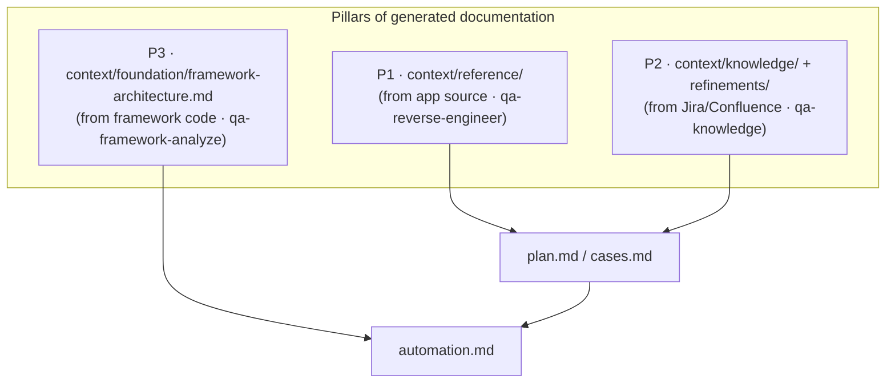
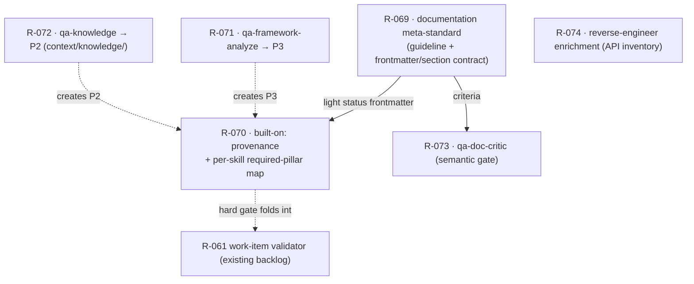

# Design — Documentation pillars (foundation for plan / cases / implementation)

> **Status:** 🧊 backlog (unscheduled) · **Epic:** R-069 → R-074 (documentation pillars) ·
> **Tracked in:** [`ROADMAP.md`](../../ROADMAP.md) · **Product sections:** PRD §2/§8, TECH §11.
>
> This is a **design record only** — no code ships with it. It captures the pillar model, the gap analysis,
> and the user-locked decisions so the epic can be picked up later (the same way R-062→R-068 was first
> captured in [`qa-artifact-templates.md`](qa-artifact-templates.md), then shipped). When an item is
> implemented, generalize the `.external` reference material stack-agnostically into `core` (the R-062→R-068
> pattern), run `npm test` (parity included), and flip the item to ✅ in `ROADMAP.md`.

## Why

The QA orchestration's three authoring outputs — the **test plan**, the **test cases**, and **their
implementation** — must all rest on **pillars of generated documentation**:

- **P1 — application pillar:** docs generated from the **application-under-test source** (what the system
  does, its architecture, entry points, data model).
- **P2 — requirements pillar:** docs generated from **Jira tickets / Confluence pages** (domain knowledge,
  business rules, glossary, decisions).
- **P3 — framework pillar:** docs generated from the **test-framework code** (base classes, fixtures, page
  objects/helpers, config, extension points) so authored test code matches the framework architecture *as
  documented*, not as guessed.

Two cross-cutting rules complete the model:

1. Implemented test-case code must conform to the **standards/guidelines** *and* be consistent with the
   **documented** framework architecture (P3).
2. **Every generated document must itself conform to a meta documentation standard** — frontmatter, section
   shape, grounding, length — so the pillars are uniform and machine-checkable.

The current product already has building blocks: **P1** is `qa-reverse-engineer` → `context/reference/`
(R-019/R-032/R-068), and **P2-fetch** is the MCP fetch layer (R-065). Three gaps remain:

- **(a)** There is **no meta documentation standard** governing the shape of every generated doc.
- **(b)** The pillars are **not enforced as the required foundation** of plan/cases/automation — nothing
  records or checks that an artifact was actually built on them.
- **(c)** **P3 is not generated** from framework code (the durable framework doc R-067 is hand-authored
  onboarding, not a generated structural map), and **P2 has no durable knowledge base** (fetch is per-run)
  nor a semantic quality gate over generated docs.

## Gap analysis — `.external/` reference vs. current product

`.external/` is the user's **gitignored, in-production** Copilot QA setup (a Java/RestAssured microservice
estate; the same reference R-044/R-045 and `qa-artifact-templates.md` already cite as "adapted from"). It is
not committed to this repo; the comparison below is carried as session input and is generalized
stack-agnostically here.

| Capability | `.external/` reference | Current product | Gap → item |
|---|---|---|---|
| P1 — docs from app source | ✅ reverse-engineer agent | ✅ `qa-reverse-engineer` → `context/reference/` | minor enrichment → **R-074** |
| P2 — fetch Jira/Confluence | ✅ | ✅ MCP fetch layer (R-065) | — |
| P2 — durable knowledge base | ✅ structured knowledge docs | ❌ fetch is per-run only | **R-072** |
| P3 — docs from framework code | ✅ framework-architecture doc | ❌ only hand-authored `test-framework.md` (R-067) | **R-071** |
| Meta documentation standard | ✅ doc-standard governing every doc | ❌ none (per-doc prose only) | **R-069** |
| Pillars as enforced foundation | ✅ work builds on the docs | ❌ not recorded/checked | **R-070** |
| Semantic quality gate over docs | ✅ critic/review pass | ❌ only mechanical `doctor` + advisory `qa-gardening` | **R-073** |

## Pillar model

Pillar → on-disk home (so `doctor` can tell a pillar's type from its path):

- **P1 = `context/reference/`** — from app source (`qa-reverse-engineer`).
- **P2 = `context/knowledge/` + `context/refinements/`** — from Jira/Confluence (`qa-knowledge`, R-072;
  `qa-ticket-review`, R-066).
- **P3 = `context/foundation/framework-architecture.md`** — from framework code (`qa-framework-analyze`,
  R-071).

**`built-on:` provenance (a second trace dimension).** Today traceability is *vertical*:
`AC<n>` (work.md) → `Traces to:` (cases.md) → `Covers:` (automation.md). R-070 adds a *horizontal* dimension:
a `built-on:` frontmatter field listing the pillar docs an artifact rests on. The two are orthogonal — the
vertical chain proves *every criterion is tested*; `built-on:` proves *the work rests on the generated
documentation*.

**Per-skill required-pillar map** (stored in `model/artifacts.ts`, validated by `doctor`):

| Artifact (skill) | Required pillars |
|---|---|
| `plan.md` (`qa-plan`) | P1 + P2 |
| `cases.md` (`qa-test-case-design`) | P1 + P2 |
| `automation.md` (`qa-test-automate`) | **P3** (code matches the documented framework) |
| data-gen fixtures (`qa-test-data-gen`) | P1 |
| `performance.md` (`qa-performance`) | P1 (+ P3 optional) |

## Decisions locked by the user

- **Opcja 1 — meta documentation standard (1D + 1-i, tiered).** A new `documentation` guideline
  (human-readable; *references* `grounding` R-029, `diagram-conventions` R-025, `documentation-as-code`
  R-028 — no duplication) **plus** a machine contract in `artifacts.ts` (frontmatter + required sections)
  that `doctor` enforces — the same "rule + check" pattern the product already uses. **Tiered scope:**
  durable docs (`foundation/`, `reference/`, `refinements/`, `knowledge/`) get the full standard
  (frontmatter `title`/`version`/`last-updated`/`owner-skill`/`status`, single H1, "When to use this
  document", length/anti-bloat guidance); runtime artifacts (`changes/<id>/*`) get a **light** frontmatter
  (`status`, `work-id`, trace markers) + the existing `requiredSections`. The light `status` frontmatter
  feeds R-060/R-061. Genuinely-new rules the standard adds (the rest is referenced): YAML frontmatter,
  single-H1 + heading hierarchy, "When to use this document", length guidance.
- **Opcja 3 — pillars as the required foundation (3D + 3-i; shippable core = 3A).** `built-on:` frontmatter
  provenance (above) + the per-skill required-pillar map. Shippable core: `doctor` link-checks `built-on:`
  and **warns** when required pillars are missing. Hardened later: at `status: ready` the work-item
  validator (R-061) turns missing provenance into an **error** (folds into R-061).
- **Opcja 2 — framework pillar P3 (2A).** A new dedicated read→write skill `qa-framework-analyze` (twin of
  `qa-reverse-engineer`, pointed at the *test framework* code): reads framework code read-only and generates
  `context/foundation/framework-architecture.md` = P3, grounded at `file:line`. `test-framework.md` (R-067)
  stays the hand-authored onboarding/how-to-run guide; `framework-architecture.md` is the *generated
  structural map* that `qa-test-automate` reads. Re-runnable as the framework evolves (a once-only
  bootstrapper would let the doc rot).
- **Opcja 4 — durable Jira/Confluence knowledge base P2 (4A + 4-i).** A new write skill `qa-knowledge`
  fetches the indicated Confluence pages / epics via the R-065 fetch layer and synthesizes durable,
  structured knowledge docs (domain, glossary, business rules, decisions). "Querying" = the agent just reads
  these docs (no separate oracle skill). Lives in a new top-level `context/knowledge/` dir, sibling to
  `context/reference/` — crystallizing the pillar→path mapping above.
- **Opcja 5 — semantic doc quality gate (5A).** A new read-only skill `qa-doc-critic`: post-generation
  per-document semantic review against the Opcja-1 meta-standard + `grounding` (R-029) + `assumptions`
  (R-044) — hallucination check, Assumptions-table completeness, citation presence, standard conformance.
  Reports findings in chat. Sharp role separation: `doctor` = mechanical/no-LLM, `qa-gardening` = repo-wide
  drift sweep, `qa-review` = work-item coverage/traceability, `qa-doc-critic` = single-document quality.
  Could persist a `critique` artifact later under R-060.
- **Opcja 6 — P1 enrichment (6A; 6B/6C deferred).** Light closure: add an explicit **API/endpoint
  inventory** section and a **Completeness Verification** self-check (all paths/endpoints covered and
  grounded) to `system-overview.md` / `reference/`, governed by the Opcja-1 length guidance. The per-service
  split (6B) and Postman-collection analysis (6C) are deferred (R-075/R-076).

## Mapping decisions → roadmap items

| R-# | Item | Decision | Likely lands in |
|-----|------|----------|-----------------|
| **R-069** | `documentation` meta-standard guideline + machine frontmatter/section contract | 1D + 1-i (tiered) | `model/context.ts` (new guideline, refs `grounding`/`diagram-conventions`/`documentation-as-code`), `model/artifacts.ts` (frontmatter+section contract — full profile for durable docs, light `status` profile for `changes/<id>/*`), `doctor/index.ts` (new checks), `tests/{scaffold,doctor}.test.ts`, TECH §12.1, PRD §8 |
| **R-070** | `built-on:` pillar provenance + per-skill required-pillar map | 3D + 3-i (core = 3A) | `model/artifacts.ts` (`built-on:` field on `ArtifactTemplate` + type→required-pillar map), `doctor/index.ts` (link-check + warn), `model/skills.ts` (write skills populate it), `tests/*`, TECH §11, PRD §8 |
| **R-071** | `qa-framework-analyze` skill → `framework-architecture.md` (P3) | 2A | `model/skills.ts` (new read→write skill), `model/context.ts` (new foundation doc, distinct from `test-framework.md` R-067), `model/artifacts.ts`, `tests/scaffold.test.ts`, PRD §5, TECH §5/§6 |
| **R-072** | `qa-knowledge` skill + `context/knowledge/` (P2) | 4A + 4-i | `model/skills.ts` (new write skill, uses R-065 fetch), `model/context.ts` (new `knowledge/` area + root map), `model/artifacts.ts`, `tests/scaffold.test.ts`, PRD §5, TECH §6 |
| **R-073** | `qa-doc-critic` read-only semantic quality gate | 5A | `model/skills.ts` (new read-only skill; criteria = R-069 standard + `grounding`/`assumptions`), `tests/scaffold.test.ts`, PRD §5, TECH §5 |
| **R-074** | `qa-reverse-engineer` enrichment: API/endpoint inventory + Completeness Verification | 6A | `model/skills.ts` (`qa-reverse-engineer`), `model/context.ts` (`system-overview.md` sections), `tests/scaffold.test.ts`, PRD §5 |

**Deferred (recorded, not scheduled):**

- **R-075** — per-service split of `context/reference/` (Opcja 6B) — for microservice/polyglot repos.
- **R-076** — `qa-postman-analysis` skill (Opcja 6C) — when teams use Postman collections.
- **R-077** — `git-sync-changelog` skill (from `.external/`) — sync service repos + a combined changelog for
  quarterly doc refresh.
- **R-078** — service-analysis-updates flow (from `.external/`) — periodic/quarterly refresh of P1 docs on
  source drift.
- The hard `built-on:` gate at `status: ready` folds into **R-061** (the work-item validator) once shipped.

## Sequencing & dependencies

- **R-069 is the keystone** (meta-standard + contract) — do first.
- **R-070** depends on R-069's light `status` frontmatter and feeds R-061 for the hard gate.
- **R-071 / R-072** create the P3 / P2 pillars that R-070's map references → land before R-070's gate
  hardens.
- **R-073** depends on R-069 (it is the critic's criteria).
- **R-074** is independent and light.
