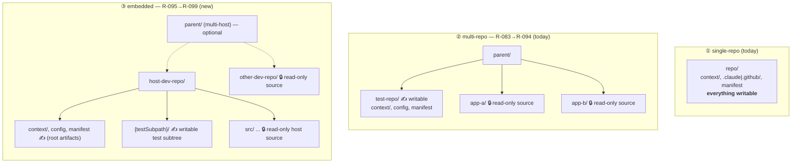

# Design — Embedded test topology (test framework lives *inside* a developer repo)

> **Status:** ✅ shipped (v0.66.0–v0.70.0) · **Epic:** R-095 → R-099 (embedded test topology) ·
> **Tracked in:** [`ROADMAP.md`](../../ROADMAP.md) (Backlog) · **Usage guide:**
> [`docs/embedded-tests.md`](../embedded-tests.md) · **ADR:**
> [`adr/0001-embedded-test-topology.md`](adr/0001-embedded-test-topology.md) ·
> **Product sections:** TECH §8/§10/§11.
>
> This is the **design record** captured in an interactive planning session, the same way the
> [multi-repo epic](multi-repo-orchestration.md) and the
> [documentation-pillars epic](documentation-pillars-R069-074.md) were captured before they shipped.
> It records the scenario, the data-model/boundary contract, and the seven user-locked decisions the
> implementation will follow. The authoritative per-item record becomes the **Shipped** table in
> `ROADMAP.md` as each item lands. This epic **extends the shipped multi-repo epic (R-083 → R-088)** —
> it reuses `WorkspaceInfo`, the guardrail layers, and the `doctor`/`update` topology awareness rather
> than adding a parallel machinery.

## Why

The product recognizes **two** repository topologies today:

1. **Single-repo** — `npx <pkg> init --root <repo>`. Scan root = write root; dev source and tests share
   one repo; every artifact lands in it (`packages/core/src/scaffold/index.ts`).
2. **Multi-repo** (R-083 → R-094) — `init --root <parent>` over a parent holding several sibling repos:
   one **test repo** (the only writable area) and several read-only **developer repos**. Activates when
   the parent holds ≥2 qualifying repos; recorded in `manifest.workspace` (`WorkspaceInfo`).

A common real-world layout fits **neither**: the test framework has **no repository of its own** — it
lives **inside one of the developer repos** as a dedicated subtree (an `e2e/` folder, or a build module
such as a Maven submodule / Gradle subproject / workspace package). The multi-repo model can't represent
it, because it assumes *test repo ≠ any dev repo* and marks a whole dev repo read-only — yet here we must
**write into a test subtree of a repo that is otherwise developer source**.

The crux: **the writable area is a *subtree* of a repo that, as a whole, is a developer repo.**

This occurs in **two variants**, both in scope:

- **(a) single-host** — one application repo that contains both source and the test subtree; no sibling
  repos.
- **(b) multi-host** — a parent with several dev repos where **one** hosts the embedded test subtree; the
  others remain read-only source.

## The three topologies



**Writable set `W`** (embedded) = orchestration config at the host root (`context/**`, `.claude/**` or
`.github/**`, the manifest) **∪** `host/{testSubpath}/**`.
**Read-only set `R`** = the rest of the host repo (application source) **∪** any other developer repos.

## Backward-compatibility invariant (load-bearing)

Embedded mode is **never** entered silently. If `testSubpath` is absent from the resolved workspace, every
command behaves **exactly as today** (single-repo or multi-repo). In particular:

- **`--yes` / CI without `--test-subpath` never activates embedded mode** — it stays on the existing
  single/multi path. Embedded in automation is opt-in via flags only.
- Existing single-repo and multi-repo scaffolds, snapshots, and the parity test stay green **unchanged**;
  every new render var collapses to `""` when `testSubpath` is unset.

## Decision D1 — data model: extend `WorkspaceInfo` with `testSubpath`

Reuse the existing `WorkspaceInfo` (multi-repo machinery) rather than a parallel type:

```jsonc
"workspace": {
  "testRepo": "host-dev-repo",   // the host repo (multi-host) or "." (single-host)
  "devRepos": ["other-dev-repo"], // read-only sibling source; [] in single-host
  "testSubpath": "e2e",           // NEW — POSIX-relative subtree inside the host that is writable
  "workspaceFile": "../ws.code-workspace"  // multi-host only (R-086)
}
```

- `testSubpath` is **optional**; absent ⇒ current behavior (the compatibility invariant).
- Validation (`doctor` + install): non-empty, relative, not `"."`, exists on disk, resolves **inside** the
  host. Rejected otherwise.
- The semantic overload of `testRepo` (a dedicated repo name in multi-repo; the host repo / `"."` in
  embedded) is documented on the type and enforced by `doctor` — a conscious trade to reuse the machinery.
- Single-host is represented as `{ testRepo: ".", devRepos: [], testSubpath }`; the presence of
  `testSubpath` is what puts the command on the embedded path even with no parent.

*Rejected:* a separate `EmbeddedTestInfo` type (duplicates workspace/render/doctor machinery); an explicit
`layout: "single" | "multi-repo" | "embedded"` discriminator (larger refactor of every topology branch +
manifest migration — deferred as a possible future cleanup if a 4th topology appears); generalizing
`writeRoot` to any subtree (conflicts with the "config at host root" decision).

## Decision D2 — write-boundary model: three reinforcing layers

Same defense-in-depth as the multi-repo epic, adapted to a **partially** writable host:

1. **Lean root-config rule** (survives compaction), beside the iron-QA/grounding rules — an embedded
   variant of `renderMultiRepoRule`: *"The only writable area is the test subtree `{testSubpath}/` (plus
   the orchestration config at the repo root). The rest of this repo is application source — read it at
   `file:line`, never create/edit/delete there. Sibling developer repos are read-only too."*
2. **`multi-repo-boundaries` guideline** — body extended with an embedded section (✅/❌ examples). Not
   renamed now (rename to a neutral `workspace-boundaries` would churn the manifest `guidelines` contract +
   snapshots; tracked as a separate optional backlog item). `when` already fires (a `workspace` block is
   present).
3. **`doctor` leak-check** — the out-of-loop gate: nothing written **outside `W`** (host app source and
   other dev repos carry no scaffold output / agent artifacts), plus the structural checks (D5).

*Rejected:* persuasion + doctor only (drops the native editor guardrail); a denylist of app-source dirs
(fragile); editor-only or doctor-only single-layer approaches.

## Decision D3 — editor guardrail: `settings.json` (single-host) vs `.code-workspace` (multi-host)

`files.readonlyInclude` / `files.readonlyExclude` work in a plain `.vscode/settings.json`, so single-host
needs no workspace file:

- **single-host** — write `readonlyInclude` (host app source) + `readonlyExclude` (`{testSubpath}/**` +
  the config dirs) into `host/.vscode/settings.json`. **Shallow merge**: add only the readonly keys; if the
  file exists with conflicting values, leave the user's content and let `doctor` report it (never clobber
  drift — the R-034/R-039 principle).
- **multi-host** — the existing `.code-workspace` (R-086) gains a `readonlyExclude` carve-out so the host's
  `{testSubpath}` + config dirs stay writable while the host's source and other dev repos are read-only.

*Rejected:* always emit a one-folder `.code-workspace` for single-host (forces opening via a workspace
file; awkward for one repo); editor-guardrail per variant behind a wizard flag (extra config axis, against
the lean/deterministic principle).

## Decision D4 — detection & activation: full hybrid, flags for CI

Mirror the mature R-083 detection pattern, at the **subtree** level (kept **separate** from
`enumerateRepos`, so the repo-level multi-repo path is untouched):

- `enumerateTestSubtrees(host)` — bounded, deterministic discovery of candidate test subtrees (a subtree
  carrying a test-framework config such as `playwright.config` / `testng.xml`, or a `TEST_REPO_HINTS`-named
  module with its own build manifest), reusing the `buildRepoInventory` signals.
- `chooseTestSubtree(candidates)` — deterministic top pick for the non-interactive path.
- **Interactive:** the wizard proposes the detected subtree and lets the user confirm / correct / decline.
- **Flags:** `--test-subpath <path>` (and `--test-host <repo>` in multi-host) override detection.
- **`--yes` / CI without `--test-subpath` never activates embedded** (the compatibility invariant).

*Rejected:* auto-heuristic that activates under `--yes` (breaks compatibility); flag-only with no
interactive proposal (poor UX); generalizing `enumerateRepos` to descend into modules (mixes repo and
subtree levels, risks multi-repo regression).

## Decision D5 — multi-host precedence + `doctor`/`update`

**Precedence (multi-host):** dedicated test-repo **wins**; embedded is the **fallback**. First run
`chooseTestRepo` (R-083); only if **no** repo qualifies as a dedicated test-repo do we look for an embedded
subtree inside a dev repo. The `--test-host` + `--test-subpath` flag pair is the explicit override for CI
and for mixed layouts the heuristic can't resolve.

*Rejected:* unified repo-vs-subtree scoring (unpredictable, risks R-083 regression); mutually-exclusive
"one topology per install" (can't express a real mix of a dedicated test-repo alongside other embedded
dev repos).

**`doctor`** — full validation: `testSubpath` exists and is a subtree of the host, config is at the host
root, the boundary rule + guideline are present, the editor guardrail is present (`settings.json` /
`.code-workspace`), **and** the leak-check (nothing outside `W`). Emits findings with remediation, exits
non-zero on errors — the QA-analog audit run outside the agent loop.

**`update`** — re-renders the boundary rule + guideline from the saved choices. For the merged
`settings.json` it stays **conservative**: always treat it as drift → **report**, never rewrite (avoids a
new per-key baseline model and keeps the "never clobber" guarantee). A per-key refresh can be added later
if needed.

## Decision D6 — rendered rule/guideline content

Extend `renderMultiRepoRule` with the embedded branch (keyed on `testSubpath`) and extend the
`multi-repo-boundaries` guideline body with an embedded section. One function, one guideline, one set of
snapshots. Guideline **not renamed** now (see D2). The neutral rename to `workspace-boundaries` is a
separate, optional backlog item so this epic's diff stays migration-safe.

## Decision D7 — documentation

A dedicated usage guide at [`docs/embedded-tests.md`](../embedded-tests.md) (how to use embedded mode:
when, the wizard flow, CI flags, what gets generated, the write-boundary, verifying with `doctor`,
migrating with `update`, troubleshooting an existing `.vscode/settings.json`). Plus a pointer section in
TECH §8/§10/§11 and this design record. No PRD change beyond a one-line topology mention if a natural slot
exists.

## The epic — 5 items (R-095 → R-099)

| Item | Scope | Key landing files |
|------|-------|-------------------|
| **R-095** | Data model + render: `WorkspaceInfo.testSubpath`; `renderMultiRepoRule` embedded branch; `multi-repo-boundaries` guideline body | `types.ts`, `scaffold/index.ts`, `model/context.ts`, `tests/` |
| **R-096** | Detection + CLI + wizard: `enumerateTestSubtrees`/`chooseTestSubtree`; `--test-subpath`/`--test-host`; wizard proposal; multi-host precedence | `detect/repo-map.ts`, `wizard/index.ts`, `cli.ts`, `tests/` |
| **R-097** | Editor guardrail: single-host `.vscode/settings.json` (shallow merge) + multi-host `.code-workspace` `readonlyExclude` carve-out | `scaffold/index.ts`, `adapters/*`, snapshots |
| **R-098** | `doctor` (structure + leak-check) + `update` (re-render; `settings.json` drift→report) topology awareness | `doctor/index.ts`, `update/index.ts`, `tests/` |
| **R-099** | Docs: `docs/embedded-tests.md` usage guide + this design record + TECH pointer | `docs/embedded-tests.md`, `TECH.md`, `docs/design/*` |

Strict order: **R-095** is the foundation (model + render); **R-096/R-097** build on the `testSubpath`
field; **R-098** closes the re-run loop; **R-099** documents.

## Decision log (session, locked)

| # | Topic | Decision | Rejected alternatives |
|---|-------|----------|-----------------------|
| D1 | Data model | Extend `WorkspaceInfo` with optional `testSubpath`; `testRepo` = host (`"."` single-host) | separate `EmbeddedTestInfo`; explicit `layout` enum; generalize `writeRoot` |
| D2 | Write-boundary | 3 layers: root-config rule + guideline + `doctor` leak-check; `W` = config@root ∪ `testSubpath/**` | persuasion+doctor only; app-source denylist; single-layer editor-only/doctor-only |
| D3 | Editor guardrail | single-host `.vscode/settings.json` (shallow merge); multi-host `.code-workspace` `readonlyExclude` | always emit `.code-workspace`; wizard-flag-gated guardrail; no editor layer |
| D4 | Detection/activation | Full hybrid (`enumerateTestSubtrees`/`chooseTestSubtree`); flags override; `--yes` w/o flag never embedded | auto-activate under `--yes`; flag-only; generalize `enumerateRepos` to descend |
| D5 | Precedence + re-run | Dedicated test-repo wins, embedded fallback; flags override; `doctor` full+leak-check; `update` settings.json drift→report | unified scoring; one-topology-per-install; minimal doctor; per-key settings.json refresh |
| D6 | Rule/guideline | Extend `renderMultiRepoRule` + `multi-repo-boundaries` body; **no rename** now | separate `renderEmbeddedRule`+guideline; rename to `workspace-boundaries`; rule-in-guide-only |
| D7 | Docs | `docs/embedded-tests.md` usage guide + TECH pointer + design record; minimal/no PRD | ADR-in-design-record; guide in TECH/README only |

## Verification (per shipped item, run at repo root)

1. `npm run typecheck` — all packages clean.
2. `npm test` — the **parity test stays green unchanged** (single/multi paths byte-identical when
   `testSubpath` unset), plus new tests: `enumerateTestSubtrees`/`chooseTestSubtree` discovery, the
   `testSubpath` manifest field, the embedded `renderMultiRepoRule` branch, the extended
   `multi-repo-boundaries` guideline, the `.vscode/settings.json` merge (single-host) + `.code-workspace`
   `readonlyExclude` (multi-host) snapshots, `doctor` structure + leak-check findings, `update`
   `settings.json` drift→report.
3. `npm run build` — both leaves bundle.
4. End-to-end (single-host): `init --root <app> --test-subpath e2e` writes config at the app root, marks
   `e2e/` + config writable and the rest read-only in `.vscode/settings.json`, records `testSubpath` in the
   manifest; the agent-facing root rule names `e2e/`.
5. End-to-end (multi-host): parent with `app-a/` (hosts `app-a/e2e`) + `app-b/` (source);
   `init --root <parent> --test-host app-a --test-subpath e2e` scaffolds into `app-a` root, `.code-workspace`
   carves out `app-a/e2e` writable while `app-a` source + `app-b` are read-only.
6. `doctor` — clean on a valid embedded scaffold; drop a stray file into host app source or a dev repo →
   leak error; point `testSubpath` at a missing dir → validation error.
7. Regression: `init --root <one-repo> --yes` (no flag) and `init --root <parent> --yes` (dedicated
   test-repo present) produce today's output exactly.
