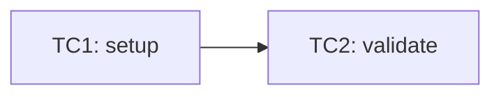

# Design — Rich, prescriptive QA artifact templates

> **Status:** ✅ implemented (shipped v0.40.0→v0.46.0) · **Epic:** R-062 → R-068 (rich artifact templates) ·
> **Tracked in:** [`ROADMAP.md`](../../ROADMAP.md) · **Product sections:** PRD §5/§8, TECH §3/§6/§11/§12.
>
> Implementation notes (where the shipped code differs from this design): the per-type `.jira` bodies and
> the configurable TQA bits (summary prefix, required label, doc-space link) ship as guidance embedded in
> the producing skill bodies + angle-bracket configurable slots in the templates, not as separate template
> files; `doctor`'s broken-link check now skips links inside code spans so the embedded conversion table /
> templates don't false-positive. The R-061 work-item validator (separate epic) will consume the new
> `requiredSections`.

## Why

R-059 (v0.39.0) lifted the runtime artifacts under `context/changes/<work-id>/` into a single
registry (`packages/core/src/model/artifacts.ts`, `ARTIFACTS` + `tpl()`) with parseable trace markers
(`AC<n>`, `Traces to:`, `Covers:`) and a `status:` field. The seeded shapes are deliberately **lean**.

This epic makes six core templates **richer and prescriptive**, distilled from the mature TQA agents in
the `.external` reference config (a real, in-production Copilot QA setup for a Java/RestAssured
microservice estate). The TQA material is environment-specific (VWGroup Jira, RestAssured, `Services.java`
component resolution, devstack URLs); here it is **generalized to a stack-agnostic, English, two-phase
template** that fits the existing house style:

- `endpoint` → `feature area / acceptance criterion`
- framework layers `C+TD+S+T` → `{{AUTOMATION_FRAMEWORK}}`-driven
- coverage by endpoint → coverage by area / AC

The templates remain **redesigned in place** (same registry / foundation / reference layers) so trace
markers, the parity test, and `doctor` keep working.

## Scope — six templates

| # | Template | Layer | Producer | Item |
|---|----------|-------|----------|------|
| 1 | Test plan (`plan.md`) | runtime | `qa-plan` | R-062 |
| 2 | Test cases (`cases.md`) | runtime | `qa-test-case-design` | R-063 |
| 3 | Bug report (`bug-report.md` + `.jira`) | runtime | `qa-bug-report` | R-064 |
| 4 | Ticket refinement (`refinements/*.md` + `.jira`) | dedicated | `qa-ticket-review` (→ write) | R-066 |
| 5 | Test-framework doc (`test-framework.md`) | foundation | `qa-automation-bootstrapper` | R-067 |
| 6 | Project/service doc (QA test-surface in `system-overview.md`) | reference | `qa-reverse-engineer` | R-068 |

Plus supporting infrastructure: a shared **Markdown→Jira** machine (R-064, reused by R-066) and an
**MCP fetch** layer (R-065 — opt-in `xray` + `markitdown` servers + the `mcp-content-fetch` guideline).

## Cross-cutting decisions

- **Richness:** richer / prescriptive (more sections, embedded ✅/❌ guidance, inline hints).
- **Two-phase:** phase-1 placeholders auto-filled by the installer; the rest left for phase 2.
- **Grounding:** every claim cites `file:line` / MCP / source; inferences live in an Assumptions table
  only (composes with the `grounding` R-029/R-045 and `assumptions` R-044 guidelines).
- **Dual Jira output** (bug + ticket): canonical Markdown is the source of truth; the `.jira` file is a
  deterministic transform via the shared conversion machine. TQA-specific bits (`[TQA]` summary prefix,
  required label, doc-space link, devstack-style URLs, `Services.java` resolution) become **configurable
  phase-2 slots / wizard questions**, never hardcoded.
- **Parity:** both adapters (Claude `SKILL.md`, Copilot `prompt.md` + agent) render identically; the
  parity test in `core/tests/scaffold.test.ts` gates every item.

---

## 1. Test plan (`plan.md`) — R-062

Rich, three-perspective **living plan** in `context/changes/<work-id>/plan.md` (replaces the lean R-059
shape). Three clearly separated perspectives — **Business (PO)**, **Architecture**, **Implementation
(Tester)** — plus **business-level test cases** (the detailed/automatable cases live in `cases.md`).

- **Business view:** business driver, acceptance criteria mirroring `work.md` `AC<n>`, P1–P3 priorities
  with business justification, out of scope.
- **Architecture view:** coverage overview (area/AC × positive/negative/edge × current/target), risk
  areas, open questions for review, a sign-off checklist.
- **Implementation view:** test-case summary table (TC | Traces to | Type | Priority | Level |
  Dependencies | Status), business test cases (what it tests / verifies / preconditions / input /
  expected / priority — `Traces to: AC<n>`), reference pattern, work division, dependencies &
  prerequisites, a Mermaid dependency diagram (per `diagram-conventions`, wrapped in `@formatter:off/on`).
- **+** Clarification checklist, Source references (grounding), Assumptions, Changelog.

`requiredSections` = `["Business view", "Architecture view", "Implementation view"]`. Frontmatter
`status: in-progress`. Full template in the [appendix A1](#a1).

## 2. Test cases (`cases.md`) — R-063

`cases.md` is redefined as the **detailed, executable layer** derived from the plan's business test
cases; each case becomes one automated test (`Covers: TC<n>` in `automation.md`).

Per case `## TC<n>`: `Traces to: AC<n>` (+ optional parent business-TC), Type
(Positive/Negative/Parameterized/Edge), Priority, Test level, Preconditions, **Test data** (named
factory/fixture — R-010), Steps, Expected result, and a **Variants** table (Input→Expected for
parameterized / boundary / invalid — composes with `test-data-management` R-036).

`traceField: "Traces to"`; `requiredSections: []` (R-061 validates per-case: every `TC<n>` must carry
`Traces to:`). Full template in the [appendix A2](#a2).

## 3. Bug report (`bug-report.md` + `.jira`) — R-064

Rich defect report with **dual output**: canonical `bug-report.md` + paste-ready
`bug-report.jira` (wiki markup, service-behavior perspective, `{code}` blocks for logs/stacktraces).

Sections: header (Severity/Priority, Environment, `Work-item / AC`, Suspected area from `qa-rca`),
Preconditions, Steps to reproduce, Expected vs actual, Impact, Observations/logs (factual, service-level
only — not test mechanics), Root cause summary (inferences as Assumptions), Suggested fix, Regression
risk, Evidence (result MCP / `tools.md`), Open questions.

`requiredSections = ["Steps to reproduce", "Expected vs actual", "Evidence"]`. The `.jira` is produced by
the shared Markdown→Jira machine (§ "Shared Jira machine"). Full template in the [appendix A3](#a3).

## 4. Ticket refinement (`refinements/*` + `.jira`) — R-066

A **new, dedicated deliverable** under `context/refinements/<YYYY-MM-DD>-<KEY>-<slug>.md` + `.jira`.
Standalone (does **not** require a work-id — refinement often precedes the work-item). `qa-ticket-review`
flips **read-only → write**.

All **5 merged ticket types**: Bug, Story/Feature, Task/Sub-task, Maintenance, Test Case (API).

- **Canonical Markdown:** frontmatter (`jira_key`, `ticket_type`, `status`, `date`, `related_docs`);
  sections Context, Goals/Non-Goals, Scope/Out of scope, Impacted files & classes (code-scan + grounding),
  Solution options, **Recommendation ≥3** (Conservative / Extensible / Performance [+ optional Tooling],
  each with trade-offs), Acceptance criteria, Suggested tests, Risks, Dependencies, Documentation links,
  Open questions (`[Required input — not provided]` for gaps), Definition of Done.
- **`.jira`:** 100% wiki markup; a Jira-field header (Issue Type, Summary with a **configurable prefix**,
  Priority, Component/s, Labels with a **configurable required-label**, Attachment note, Linked Issues) +
  one of the 5 per-type bodies.

Rules baked into the procedure: **zero-assumptions**, conflicting sources flagged explicitly,
service-behavior perspective, `{code}/{panel}/{info}/{warning}/{noformat}` macros preserved,
`{{...}}`→`{noformat}` for content with `{N}` regex quantifiers.

`requiredSections = ["Context", "Recommendation", "Acceptance criteria"]`. Full templates in the
[appendix A4](#a4).

## 5. Test-framework doc (`test-framework.md`) — R-067

Split: `foundation/tools.md` **keeps its narrow, machine-read role** (result paths + run command for
result-legibility, read by `qa-rca`/`qa-test-automate`). A new durable **`foundation/test-framework.md`**
is the rich onboarding guide, owned by `qa-automation-bootstrapper`.

Sections: Stack (framework/build/language + key libraries), Project test layout (cross-links
`repo-map.md`), **How to run** (command matrix: all / single / tagged / headed-debug / update-snapshots),
Conventions (base class/fixtures, page-objects/request-builders, tags, naming → `test-naming`),
Authentication & environment setup (→ `environments.md`, `environment-management`), How to add a new test,
Reference example tests, CI integration (→ `qa-ci-pipeline`).

Phase-1 auto-fill: `{{AUTOMATION_FRAMEWORK}}`, `{{BUILD_TOOL}}`, `{{PROJECT_LANGUAGE}}`,
`{{RUN_COMMAND}}`. `requiredSections = ["Stack", "How to run", "Conventions"]`; `doctor` expects the file.
Full template in the [appendix A6](#a6).

## 6. Project/service doc — QA test-surface lens — R-068

C4 (L1–L3) stays untouched as the **architecture** layer. The existing "Test surface" section in
`context/reference/system-overview.md` expands into a **QA test-surface lens** — the testing view over the
architecture:

- **Integration points** (Integrated system · Repo/module · Integration point · Direction · Protocol ·
  Data exchanged · Test focus) — the map for integration-test planning.
- **Entry-point inventory** (entry point · type HTTP/CLI/job/event · source `file:line` · covered? ).
- **Data model & boundaries** (field/entity · type · valid · invalid/boundary · source `file:line`).
- **Test scenarios summary** (high-level positive/negative/integration; links to `cases.md`).
- **Questions & issues** (ID · question/uncertainty · impact · status).

All claims verified at `file:line` (grounding); inferences in an Assumptions table. Integration diagrams
wrapped per `diagram-conventions`. Full template in the [appendix A7](#a7).

---

## Shared Jira machine (`model/jira.ts`) — R-064, reused by R-066

A single Markdown→Jira conversion table (headings, bold/italic, inline/fenced code, lists, checkboxes,
links, quotes, tables, images, rules), plus a per-type body renderer for the 5 ticket types. Used by both
the bug report (#3) and ticket refinement (#4) so there is one source of the transform. Verified by
snapshot tests. Full table in the [appendix A5](#a5).

## MCP fetch layer — R-065

Two **opt-in** MCP servers wired alongside the existing `atlassian` server (R-009), with `${VAR}`
secret indirection and platform-correct envelopes:

- **`xray`** — for Jira issue types Test / Test Execution / Test Plan / Test Set.
- **`markitdown`** (`microsoft/markitdown`) — converts binary attachments (`.docx/.pdf/.pptx/.xlsx/
  .html/.msg/.epub`) to Markdown; **local paths only**.

A new **`mcp-content-fetch` guideline** (ported from the TQA SKILL) codifies the flow and its ordering
guarantees (violations are the #1 cause of hallucinated summaries):

1. `getIssue` → (Xray if a test issue) → Confluence (`getPage`/`searchConfluence`) → `getAttachments`
   → `getAttachmentContent`.
2. **Download** to `context/refinements/.attachments/<source-id>/<filename>` (source-id =
   `JIRA-KEY | PAGE-ID | XRAY-KEY`).
3. **Pre-flight verify** (exists, size > 0) **before** convert.
4. **markitdown convert** on the local path only (never a URL / attachment-id); read text formats
   directly; `view_image` for images.
5. Cleanup the staging dir (git-ignored).

Source priority: Jira+Xray (test issues) > Jira > Confluence > Attachments. `doctor` expects the
guideline file + its ✅/❌ examples.

## Interaction with the runtime-artifact-integrity epic (R-060 / R-061)

- **R-060** (persist read-only analyses as artifacts): unchanged by this epic, **except** R-066 already
  flips `qa-ticket-review` to write and relocates it to `context/refinements/` (R-060 had scoped a
  `ticket-review.md` under `changes/`). R-060's description must drop `qa-ticket-review` from its scope.
- **R-061** (`doctor` work-item validator + `status:` gating): extend with the new `requiredSections`
  (plan, bug, refinement) and account for the separate `context/refinements/` area. Trace markers
  (`AC<n>`/`TC<n>`/`Covers`) are unchanged.

## Verification (per item)

- `npm test` (core: detect/render/scaffold + **parity** + artifacts) and `npm run typecheck` green.
- `init --root <tmp> --yes` then `doctor --root <tmp>` clean (new files/sections detected, no leftover
  phase-1 placeholders, iron QA rule intact, links valid).
- R-064/R-066: snapshot tests for the Markdown→Jira machine. R-065: `mcp.ts` tests (env-var indirection,
  platform-correct envelope).

---

## Appendix — verbatim templates

The full, ready-to-paste template bodies (for `artifacts.ts` / `context.ts`) live in the approved
planning document and are reproduced here as the authoritative source on implementation.

<a id="a1"></a>
### A1 — `plan` (`context/changes/<work-id>/plan.md`)

````markdown
---
status: in-progress
---
# Test plan: <work-id> — <title>

> Living document. Three perspectives: Business (PO) · Architecture · Implementation (Tester).
> Derives from work.md acceptance criteria; updated in place as work progresses.
> Reads first: spec-driven-development, test-strategy, grounding, assumptions guidelines.

| Field | Value |
|-------|-------|
| **Work-item** | <work-id> |
| **Source** | <ticket / spec link> |
| **Plan version** | 1.0 |
| **Last updated** | <YYYY-MM-DD> |

## Business view
- **Business driver:** <why this work matters — business outcome>
- **Acceptance criteria:** AC1 … (mirrors work.md; source of truth)
- **Priorities:** P1 critical / P2 important / P3 nice-to-have — each with business justification
- **Out of scope:** <what is explicitly NOT covered>

## Architecture view
### Coverage overview
| Area / AC | Cases | Positive | Negative | Edge | Current | Target |
|-----------|-------|----------|----------|------|---------|--------|
| AC1 | 3 | 1 | 1 | 1 | 0% | 100% |
- **Risk areas:** <where defects are most likely or most costly>
- **Open questions (for review):** <decisions to confirm before implementation>
- **Sign-off checklist:** [ ] scope covers critical ACs · [ ] priorities reflect criticality · [ ] no critical scenario missing · [ ] out-of-scope acceptable

## Implementation view
### Test case summary
| TC | Traces to | Type | Priority | Level | Dependencies | Status |
|----|-----------|------|----------|-------|--------------|--------|
| TC1 | AC1 | Positive | P1 | API | — | planned |
### Business test cases
#### TC1: <business scenario name>
- **What it tests:** <user action / behavior exercised>
- **What it verifies:** <expected business outcome>
- **Preconditions / Input / Expected result:** <…>
- **Priority:** P1 — <why> · **Traces to:** AC1
### Reference pattern
<existing test in the repo this should mirror — path + why>
### Work division
| Workstream | Scope | TCs | Depends on |
|------------|-------|-----|------------|
| WS-1 | <area> | TC1..TCn | — |
### Dependencies & prerequisites
- **Data setup / cleanup · cross-test sequencing · environment · auth** (only what applies)
### Dependency diagram
<!-- @formatter:off -->

<!-- @formatter:on -->

## Clarification checklist
| # | Topic | Question | Status | Answer |
|---|-------|----------|--------|--------|
| Q1 | <topic> | <question> | open / resolved | <answer> |

## Source references
| Source | Path / URL | What was extracted |
|--------|------------|--------------------|
| <doc> | <path#Lnn / url> | <takeaways> |

## Assumptions
| ID | Claim | Basis | Impact | Verification | Confidence |
|----|-------|-------|--------|--------------|------------|

## Changelog
| Date | Author | Change |
|------|--------|--------|
````

<a id="a2"></a>
### A2 — `cases` (`context/changes/<work-id>/cases.md`)

```markdown
# Test cases: <work-id>

> Detailed, executable test-case specs derived from the plan's business test cases.
> Each case traces to an acceptance criterion and becomes one automated test
> (referenced as `Covers: TC<n>` in automation.md).
> Reads first: spec-driven-development, test-naming, test-data-management.

## TC1: <case title>
- **Traces to:** AC1            <!-- + parent business case from plan, if applicable -->
- **Type:** Positive | Negative | Parameterized | Edge
- **Priority:** P1 | P2 | P3
- **Test level:** unit | API | E2E
- **Preconditions:** <state / setup required>
- **Test data:** <factory / fixture name — see qa-test-data-gen>
- **Steps:**
  1. <action>
- **Expected result:** <observable, asserted outcome>
- **Variants (parameterized / boundary / invalid):**
  | Input | Expected |
  |-------|----------|
  | <valid baseline> | <pass> |
  | <boundary> | <…> |
  | <invalid> | <error / rejection> |
```

<a id="a3"></a>
### A3 — `bug-report` (`context/changes/<work-id>/bug-report.md` + `.jira`)

````markdown
# Bug: <one-line summary>
- **Severity / Priority:** <S1–S4 / P1–P4>
- **Environment:** <env, build/version, runtime/browser>
- **Work-item / AC:** <work-id> · AC<n>
- **Suspected area (from qa-rca):** <component / module>

## Preconditions
- <state before reproduction>

## Steps to reproduce
1. <step>

## Expected vs actual
- **Expected:** <…>
- **Actual:** <…>

## Impact
<who / what is affected; blast radius>

## Observations / logs
> Factual, service-level excerpts only — no test-internal mechanics.
```
<raw log / response payload / HTTP code>
```

## Root cause summary
<from qa-rca; any inference marked as an Assumption (A1) per the assumptions guideline>

## Suggested fix
- <recommendation(s)>

## Regression risk
<related areas to re-test>

## Evidence
- <trace / screenshot / log via result MCP server or tools.md paths>

## Open questions
- <unresolved>
````

`bug-report.jira` is generated from the above via the shared Markdown→Jira machine (A5), using the
**Bug** body (A4.1).

<a id="a4"></a>
### A4 — `refinement` (`context/refinements/<YYYY-MM-DD>-<KEY>-<slug>.md` + `.jira`)

Canonical Markdown:

```markdown
---
jira_key: <KEY>
ticket_type: Bug | Story/Feature | Task/Sub-task | Maintenance | Test Case
status: Draft
date: <YYYY-MM-DD>
related_docs: []
---
# <ticket_type>: <title>

## Context
<factual, from fetched Jira / Xray / Confluence / attachments; mark gaps [Required input — not provided]>

## Goals / Non-Goals
## Scope / Out of scope
## Impacted files & classes
- <File / Class> — <path#Lnn>          <!-- from codebase scan; grounding -->
## Solution options
## Recommendation
1. **Conservative** — <approach> · trade-offs: <…>
2. **Extensible** — <approach> · trade-offs: <…>
3. **Performance** — <approach> · trade-offs: <…>
   <!-- optional 4. Tooling -->
## Acceptance criteria
- <criterion>
## Suggested tests
## Risks
## Dependencies
## Documentation links
- <configurable project doc-space link>
## Open questions
- [Required input — not provided] <where applicable>
## Definition of Done
```

Per-type `.jira` bodies (100% wiki markup). Header (every type, exact order): `Issue Type · Summary
(<configurable-prefix> <…>) · Priority · Component/s · Labels (<configurable-required-label>) ·
Attachment note · Linked Issues`. Sub-task: no prefix; inherits priority/component/labels from parent;
Linked Issues = parent.

```
# A4.1 Bug
h3. Environment
h3. Preconditions
h3. Steps to Reproduce
h3. Actual Result
h3. Expected Result
h3. Impact
h3. Observations / Logs
h3. Open Questions

# A4.2 Story/Feature
h3. Story         (As a [role], I want [capability], so that [benefit].)
h3. Context
h3. Scope
h3. Out of Scope
h3. Acceptance Criteria
h3. Dependencies / Risks
h3. Notes

# A4.3 Task/Sub-task
h3. Objective
h3. Description
h3. Definition of Done

# A4.4 Maintenance
h3. Maintenance Type   (Dependency upgrade | Refactor | Tech debt | CVE fix | Config change | Cleanup)
h3. Goal
h3. Current State
h3. Proposed Change
h3. Backward Compatibility
h3. Out of Scope
h3. Verification
h3. Acceptance Criteria

# A4.5 Test Case (API only)
h3. API Endpoint   (<method> <path>)
h3. Preconditions
h3. Test Steps
h3. Expected Result
h3. Affected Codebase
h3. Recommendations   (# Conservative / # Extensible / # Performance)
```

<a id="a5"></a>
### A5 — Markdown→Jira conversion table (`model/jira.ts`)

| Markdown | Jira wiki markup |
|----------|------------------|
| `# H1` / `## H2` / `### H3` | `h1.` / `h2.` / `h3.` |
| `**bold**` | `*bold*` |
| `*italic*` / `_italic_` | `_italic_` |
| `` `inline` `` | `{{inline}}` (caveat: `{noformat}` if `{N}` present) |
| fenced ` ```lang ` | `{code:lang}…{code}` |
| `- item` / `1. item` | `* item` / `# item` |
| `- [ ]` | `* ( )` |
| `[text](url)` | `[text\|url]` |
| `> quote` | `{quote}…{quote}` |
| table header / row | `\|\|h\|\|` / `\|c\|c\|` |
| `` | `!img!` |
| `---` | `----` |

Preserve `{code}/{panel}/{info}/{warning}/{noformat}` macros unchanged.

<a id="a6"></a>
### A6 — `test-framework.md` (foundation)

```markdown
# Test framework

> Durable. How the automation framework is organized and how to work in it.
> Owned by qa-automation-bootstrapper; enriched in phase 2.
> Machine-read result paths live in tools.md — don't duplicate them here.
> Reads: qa-conventions, test-naming, code-formatting, environment-management.

## Stack
- **Framework:** {{AUTOMATION_FRAMEWORK}} · **Build tool:** {{BUILD_TOOL}} · **Language:** {{PROJECT_LANGUAGE}}
- **Key libraries / versions:** {{KEY_LIBRARIES}}

## Project test layout
<where tests live; directory structure; naming — cross-links context/foundation/repo-map.md>

## How to run
| Mode | Command |
|------|---------|
| All tests | {{RUN_COMMAND}} |
| Single test / file | {{RUN_SINGLE}} |
| By tag / group | {{RUN_TAGGED}} |
| Headed / debug / UI | {{RUN_DEBUG}} |
| Update snapshots / baselines | {{RUN_UPDATE}} |

## Conventions
- **Base test class / fixtures:** <setup/teardown entry points>
- **Page objects / request builders / clients:** <the abstraction tests use>
- **Tags / categories:** <how tests are grouped>
- **Naming:** see the test-naming guideline

## Authentication & environment setup
<how tests authenticate; required env vars — see environments.md + environment-management>

## How to add a new test
1. <framework-specific step-by-step walkthrough>

## Reference example tests
- `<path>` — <which pattern it demonstrates>

## CI integration
<pointer to the qa-ci-pipeline workflow that runs this framework>
```

<a id="a7"></a>
### A7 — QA test-surface lens in `system-overview.md` (reference)

```markdown
## Test surface (QA lens)

> All claims verified at file:line (grounding); inferences live in the Assumptions table only.

### Integration points
| Integrated system | Repo / module | Integration point | Direction | Protocol | Data exchanged | Test focus |
|-------------------|---------------|-------------------|-----------|----------|----------------|------------|

### Entry-point inventory
| Entry point | Type | Source (file:line) | Covered by tests? |
|-------------|------|--------------------|-------------------|
| <METHOD /path · CLI · job · consumer> | HTTP / CLI / job / event | <path#Lnn> | yes / no / partial |

### Data model & boundaries
| Field / entity | Type | Valid | Invalid / boundary | Source (file:line) |
|----------------|------|-------|--------------------|--------------------|

### Test scenarios summary
- <high-level positive / negative / integration scenarios; link to cases.md when designed>

### Questions & issues
| ID | Question / uncertainty | Impact | Status |
|----|------------------------|--------|--------|
```
