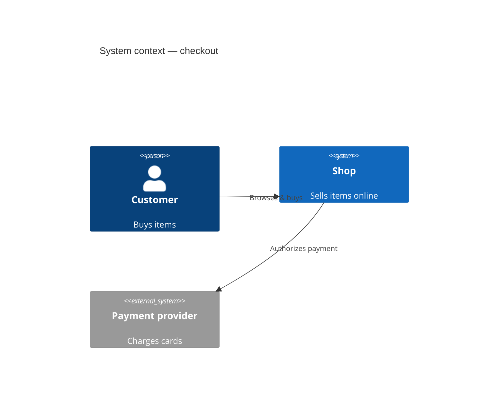
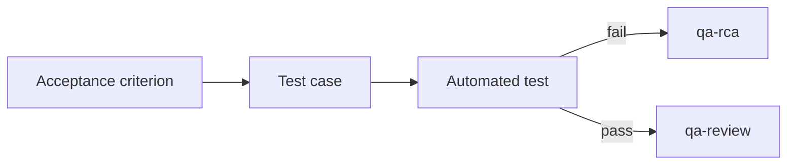

<!-- Auto-generated from packages/core/src/model/context.ts by packages/core/src/docs/guideline-flows.ts (R-090). Do not edit by hand — the snapshot test packages/core/tests/guideline-flows.test.ts fails on drift; regenerate with `npm run docs`. -->

# Diagram conventions (Mermaid)

> Phase 1 seeded this standard. Phase 2 adds the project-specific diagrams in the `{{PLACEHOLDER}}` section.

Diagrams in `context/` and in reports use **Mermaid** fenced code blocks, so they render in the tool and on the repo host, diff cleanly in version control, and never go stale as a binary image. Do not paste screenshots for an architecture or flow that could be Mermaid.

## Which diagram for what
- **`flowchart`** — process / decision flow (a test run, the daily loop, a triage path).
- **`sequenceDiagram`** — interactions over time (a request across services, an auth handshake); ideal for `qa-rca` reproductions and integration-test design.
- **`stateDiagram-v2`** — the lifecycle of an entity under test (order, session, work-item).
- **`erDiagram`** — data shapes when test data must match a schema (pairs with `qa-test-data-gen`).
- **C4 (`C4Context`/`C4Container`/`C4Component`)** — system architecture in `context/reference/` (produced by `qa-reverse-engineer`); see the C4 mapping below.

## Architecture diagrams — the C4 model
Architecture docs in `context/reference/` use the **C4 model**: four levels of zoom, each its own
diagram, so a reader picks the altitude the testing question needs. Map each level to a diagram type:

| C4 level | Scope | Mermaid diagram |
|---|---|---|
| **L1 — System Context** | the system as one box + its users and the external systems it talks to | `C4Context` (portable fallback: `flowchart`) |
| **L2 — Container** | the deployable/runnable units inside the system boundary (apps, services, data stores, queues) | `C4Container` (fallback: `flowchart`) |
| **L3 — Component** | the components inside one (testing-critical) container + their entry points | `C4Component` (fallback: `flowchart`) |
| **L4 — Code** | classes/functions inside a component — usually skipped; generate on demand | `classDiagram` (a few key types only) |

- Zoom in only as far as the testing question needs — most QA work lives at **L1–L3**.
- Mermaid's `C4*` blocks are the native fit; if a renderer lacks C4 support, fall back to a labeled `flowchart` with the same boxes/edges.
- **Don't hand-maintain L4** — it drifts from the code. Link to the source instead (per the `grounding` rule).

<!-- @formatter:off -->

<!-- @formatter:on -->

## Rules
- Fence as ```mermaid; one diagram per block; declare direction (`TD`/`LR`) explicitly.
- **Wrap every rendered diagram in `@formatter:off` / `@formatter:on` guards** (the HTML-comment form in Markdown) so an autoformatter can't reflow the fence and break the render — see the `code-formatting` guideline. Diagrams are born compliant.
- Label every node and edge meaningfully. Keep a diagram to ~15 nodes — split a bigger one by domain rather than letting it sprawl.
- The diagram **supports** the prose and traceability; it never replaces the rule that every case traces to an acceptance criterion.
- Reference real source paths in the surrounding text; don't encode detail in the diagram that will drift from the code.

## Examples (✅ good / ❌ bad — required)

> Every guideline shows the pattern, it doesn't just describe it.

✅ **Good** — a fenced, directed, meaningfully labeled Mermaid flowchart, wrapped in `@formatter:off` guards (per `code-formatting`) so an autoformat pass can't reflow it:
<!-- @formatter:off -->

<!-- @formatter:on -->

❌ **Avoid** — a pasted PNG screenshot (binary, rots, can't diff), or one
unlabeled 40-node blob with no declared direction. Don't paste an image for a
flow that could be Mermaid; split a sprawling diagram by domain instead.

## Applicable patterns

> Encouraged: diagram patterns this product favors (e.g. C4 levels for architecture,
> swimlanes for cross-team flows) so agents reach for the right shape.

{{DIAGRAM_PATTERNS}}

## Project-specific diagrams

> Add the canonical diagrams for this product (key user journeys, the system-context view) once known.

{{PROJECT_DIAGRAMS}}

## Extended — deeper diagram rules

> Maintainer reference (adapted from the diagram-standards source). The lean tier above is the deployed
> contract; this records the failure modes that motivate it. Not loaded into agent context.

### Forbidden: `classDef` styling
Do **not** use `classDef name fill:#…,stroke:#…` + `class A,B name` in committed Mermaid — it is the
single most common cause of broken diagrams:
- **Parser conflicts** — `classDef` with style properties fails outright in several renderers.
- **Keyword conflicts** — style names like `error` / `warning` / `info` collide with Mermaid keywords.
- **Line breaking** — an editor wraps a long `classDef` line and corrupts the hex colour, breaking the render.
- **Version drift** — different Mermaid versions render the same `classDef` differently, or not at all.

Convey meaning through **structure** instead — subgraphs to group, a `rect rgb(…)` block to shade a
region (e.g. an error path), node shapes (`[ ]` / `( )` / `{ }`) for kind, and `%% comments` for intent.
If colour is genuinely required, prefer `%%{init: {'theme':'base'}}%%` over per-node `classDef`.

### Node verification (composes with `grounding`)
Every node or label that names a real class, service, endpoint, or file must be **verified to exist**
before it ships — a diagram is a claim like any other. An invented box in an architecture diagram is a
hallucination; confirm it in the source and cite the path in the surrounding prose.

### Why the formatter guards are mandatory
Editors auto-format Markdown on save/commit: they add spaces after colons/commas and reflow indentation,
each of which breaks a Mermaid fence. The `<!-- @formatter:off -->` … `<!-- @formatter:on -->` pair is
ignored by Markdown renderers but respected by formatters (see `code-formatting`). An unprotected diagram
is a review reject.

### Validation checklist (before commit)
- [ ] Diagram is fenced as a `mermaid` block and wrapped in `@formatter:off` / `@formatter:on`.
- [ ] No `classDef … fill:` / `class … ;` styling.
- [ ] Direction declared (`TD` / `LR`); every node and edge labelled.
- [ ] ≤ ~15 nodes (else split by domain); every real identifier verified in source.
- [ ] One diagram per fence; the C4 level matches the doc (see the C4 table in the lean tier).
