# QA orchestration — skill catalog

> **Auto-generated** from `packages/core/src/model/skills.ts` by `packages/core/src/docs/skill-flows.ts` (R-052). **Do not edit by hand** — the snapshot test `packages/core/tests/skill-flows.test.ts` fails on drift; regenerate with `npm run docs`. Every diagram is wrapped in `@formatter:off` / `@formatter:on` guards (R-054) so an autoformatter can't reflow it.

The suite ships **21 skills** in four buckets (read-only skills get no write tools). Each skill names its recommended successors in a `## Next` section; those hand-offs form the orchestration graph below.

## How the suite fits together

The complete hand-off map — each bucket is a lifecycle swimlane, each edge a `## Next` hand-off:

<!-- @formatter:off -->
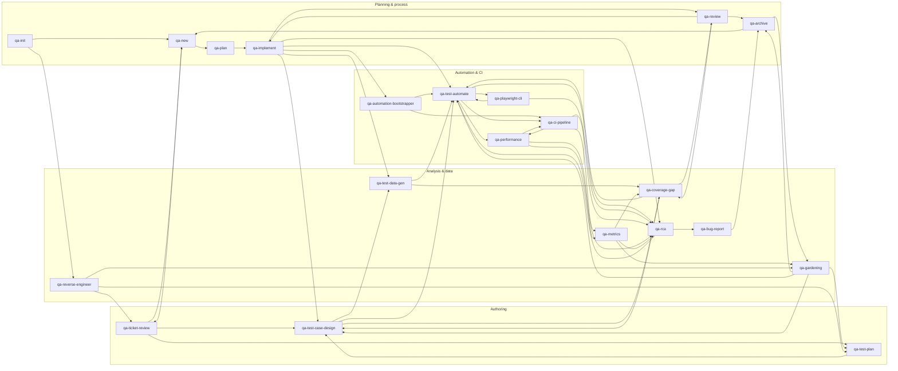
```mermaid
flowchart LR
  subgraph backbone["Planning & process"]
    qa_init["qa-init"]
    qa_new["qa-new"]
    qa_plan["qa-plan"]
    qa_implement["qa-implement"]
    qa_review["qa-review"]
    qa_archive["qa-archive"]
  end
  subgraph design["Authoring"]
    qa_ticket_review["qa-ticket-review"]
    qa_test_plan["qa-test-plan"]
    qa_test_case_design["qa-test-case-design"]
  end
  subgraph automation["Automation & CI"]
    qa_automation_bootstrapper["qa-automation-bootstrapper"]
    qa_test_automate["qa-test-automate"]
    qa_playwright_cli["qa-playwright-cli"]
    qa_ci_pipeline["qa-ci-pipeline"]
    qa_performance["qa-performance"]
  end
  subgraph analysis["Analysis & data"]
    qa_rca["qa-rca"]
    qa_test_data_gen["qa-test-data-gen"]
    qa_gardening["qa-gardening"]
    qa_coverage_gap["qa-coverage-gap"]
    qa_metrics["qa-metrics"]
    qa_bug_report["qa-bug-report"]
    qa_reverse_engineer["qa-reverse-engineer"]
  end
  qa_init --> qa_reverse_engineer
  qa_init --> qa_new
  qa_new --> qa_ticket_review
  qa_new --> qa_plan
  qa_plan --> qa_implement
  qa_implement --> qa_test_case_design
  qa_implement --> qa_automation_bootstrapper
  qa_implement --> qa_test_automate
  qa_implement --> qa_test_data_gen
  qa_implement --> qa_rca
  qa_implement --> qa_review
  qa_review --> qa_coverage_gap
  qa_review --> qa_archive
  qa_review --> qa_implement
  qa_archive --> qa_new
  qa_archive --> qa_gardening
  qa_ticket_review --> qa_new
  qa_ticket_review --> qa_test_plan
  qa_ticket_review --> qa_test_case_design
  qa_test_plan --> qa_test_case_design
  qa_test_case_design --> qa_test_data_gen
  qa_test_case_design --> qa_test_automate
  qa_test_case_design --> qa_coverage_gap
  qa_automation_bootstrapper --> qa_test_automate
  qa_automation_bootstrapper --> qa_ci_pipeline
  qa_test_automate --> qa_rca
  qa_test_automate --> qa_playwright_cli
  qa_test_automate --> qa_performance
  qa_test_automate --> qa_ci_pipeline
  qa_playwright_cli --> qa_test_automate
  qa_playwright_cli --> qa_rca
  qa_ci_pipeline --> qa_metrics
  qa_ci_pipeline --> qa_rca
  qa_ci_pipeline --> qa_performance
  qa_performance --> qa_ci_pipeline
  qa_performance --> qa_rca
  qa_performance --> qa_metrics
  qa_rca --> qa_test_automate
  qa_rca --> qa_bug_report
  qa_test_data_gen --> qa_test_automate
  qa_test_data_gen --> qa_coverage_gap
  qa_gardening --> qa_archive
  qa_gardening --> qa_test_automate
  qa_gardening --> qa_test_case_design
  qa_gardening --> qa_test_plan
  qa_coverage_gap --> qa_test_case_design
  qa_coverage_gap --> qa_test_automate
  qa_coverage_gap --> qa_review
  qa_metrics --> qa_coverage_gap
  qa_metrics --> qa_rca
  qa_metrics --> qa_gardening
  qa_bug_report --> qa_archive
  qa_reverse_engineer --> qa_ticket_review
  qa_reverse_engineer --> qa_test_plan
  qa_reverse_engineer --> qa_gardening
```
<!-- @formatter:on -->

## The two-phase install

Phase 1 is a 100% deterministic `npx` installer (no LLM); phase 2 runs in the tool and fills the markers:

<!-- @formatter:off -->
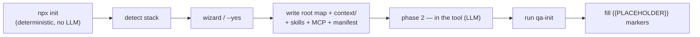
```mermaid
flowchart LR
  cli["npx <pkg> init<br/>(deterministic, no LLM)"]
  cli --> det["detect stack"]
  det --> wiz["wizard / --yes"]
  wiz --> scaffold["write root map + context/<br/>+ skills + MCP + manifest"]
  scaffold --> ph2["phase 2 — in the tool (LLM)"]
  ph2 --> init["run qa-init"]
  init --> filled["fill {{PLACEHOLDER}} markers"]
```
<!-- @formatter:on -->

## The daily work-item loop

State of record lives under `context/` — read it before acting, update it after:

<!-- @formatter:off -->
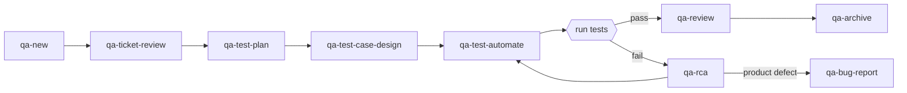
```mermaid
flowchart LR
  new[qa-new] --> ticket[qa-ticket-review]
  ticket --> plan[qa-test-plan]
  plan --> design[qa-test-case-design]
  design --> automate[qa-test-automate]
  automate --> run{{run tests}}
  run -->|pass| review[qa-review]
  run -->|fail| rca[qa-rca]
  rca --> automate
  rca -->|product defect| bug[qa-bug-report]
  review --> archive[qa-archive]
```
<!-- @formatter:on -->

## Detection, wizard & MCP wiring

How phase 1 detects the stack and wires the (read-only) result MCP plus the opt-in browser / ticketing servers:

<!-- @formatter:off -->
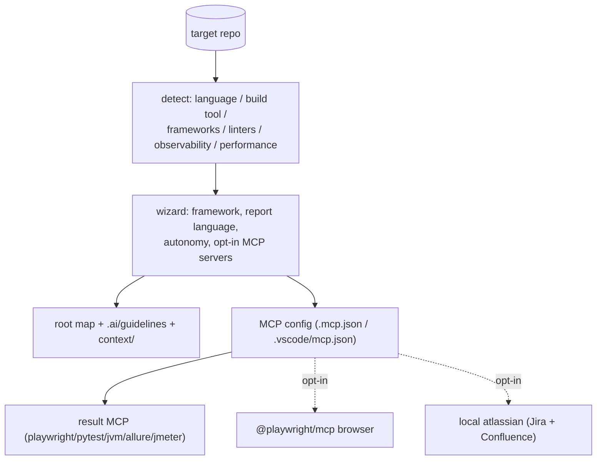
```mermaid
flowchart TD
  repo[("target repo")] --> detect["detect: language / build tool /<br/>frameworks / linters / observability / performance"]
  detect --> wizard["wizard: framework, report language,<br/>autonomy, opt-in MCP servers"]
  wizard --> root["root map + .ai/guidelines + context/"]
  wizard --> mcp["MCP config (.mcp.json / .vscode/mcp.json)"]
  mcp --> results["result MCP (playwright/pytest/jvm/allure/jmeter)"]
  mcp -.opt-in.-> browser["@playwright/mcp browser"]
  mcp -.opt-in.-> jira["local atlassian (Jira + Confluence)"]
```
<!-- @formatter:on -->

## Skills (21)

### Backbone — process & context

#### `qa-init`

Bootstrap the context/ system of record and the lean root config for this repo.

- **Model:** sonnet (balanced) · **Mode:** write
- **Reads:** —
- **Writes:** `context/foundation/test-strategy.md`, `context/foundation/environments.md`, `context/foundation/tools.md`
- **Next:** `qa-reverse-engineer` → `qa-new`

<!-- @formatter:off -->
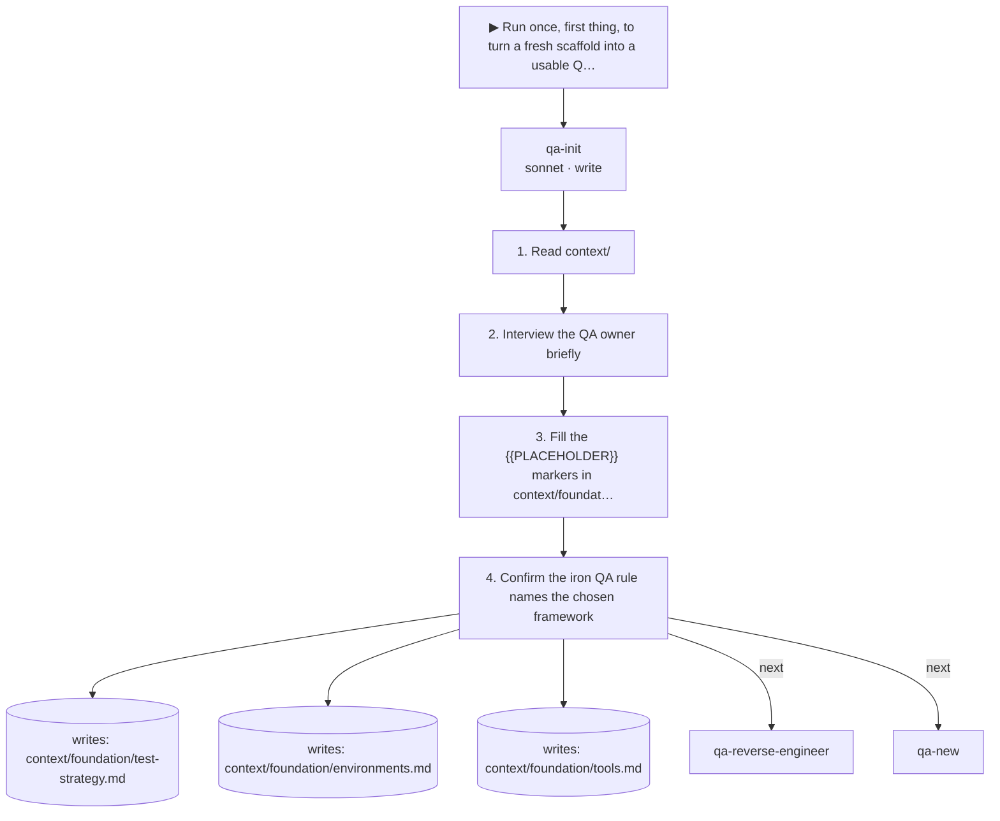
```mermaid
flowchart TD
  trig["▶ Run once, first thing, to turn a fresh scaffold into a usable Q…"]
  qa_init["qa-init<br/>sonnet · write"]
  trig --> qa_init
  s0["1. Read context/"]
  qa_init --> s0
  s1["2. Interview the QA owner briefly"]
  s0 --> s1
  s2["3. Fill the {{PLACEHOLDER}} markers in context/foundat…"]
  s1 --> s2
  s3["4. Confirm the iron QA rule names the chosen framework"]
  s2 --> s3
  w0[("writes: context/foundation/test-strategy.md")]
  s3 --> w0
  w1[("writes: context/foundation/environments.md")]
  s3 --> w1
  w2[("writes: context/foundation/tools.md")]
  s3 --> w2
  s3 -->|next| qa_reverse_engineer["qa-reverse-engineer"]
  s3 -->|next| qa_new["qa-new"]
```
<!-- @formatter:on -->

#### `qa-new`

Open a new QA work-item (a bounded unit of test work) with a stable id.

- **Model:** haiku (mechanical) · **Mode:** write
- **Reads:** `context/foundation/test-strategy.md`
- **Writes:** `context/changes/<work-id>/work.md`
- **Next:** `qa-ticket-review` → `qa-plan`

<!-- @formatter:off -->
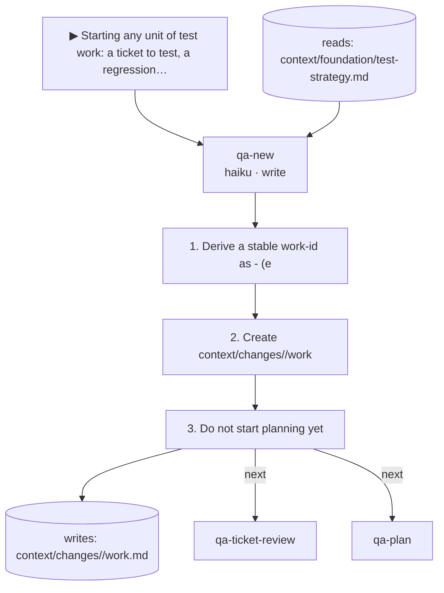
```mermaid
flowchart TD
  trig["▶ Starting any unit of test work: a ticket to test, a regression…"]
  qa_new["qa-new<br/>haiku · write"]
  trig --> qa_new
  r0[("reads: context/foundation/test-strategy.md")]
  r0 --> qa_new
  s0["1. Derive a stable work-id as <stream>-<slug> (e"]
  qa_new --> s0
  s1["2. Create context/changes/<work-id>/work"]
  s0 --> s1
  s2["3. Do not start planning yet"]
  s1 --> s2
  w0[("writes: context/changes/<work-id>/work.md")]
  s2 --> w0
  s2 -->|next| qa_ticket_review["qa-ticket-review"]
  s2 -->|next| qa_plan["qa-plan"]
```
<!-- @formatter:on -->

#### `qa-plan`

Write the test approach for a work-item before any cases or code are produced.

- **Model:** opus (heavy reasoning) · **Mode:** write
- **Reads:** `context/changes/<work-id>/work.md`, `context/foundation/test-plan.md`
- **Writes:** `context/changes/<work-id>/plan.md`
- **Next:** `qa-implement`

<!-- @formatter:off -->
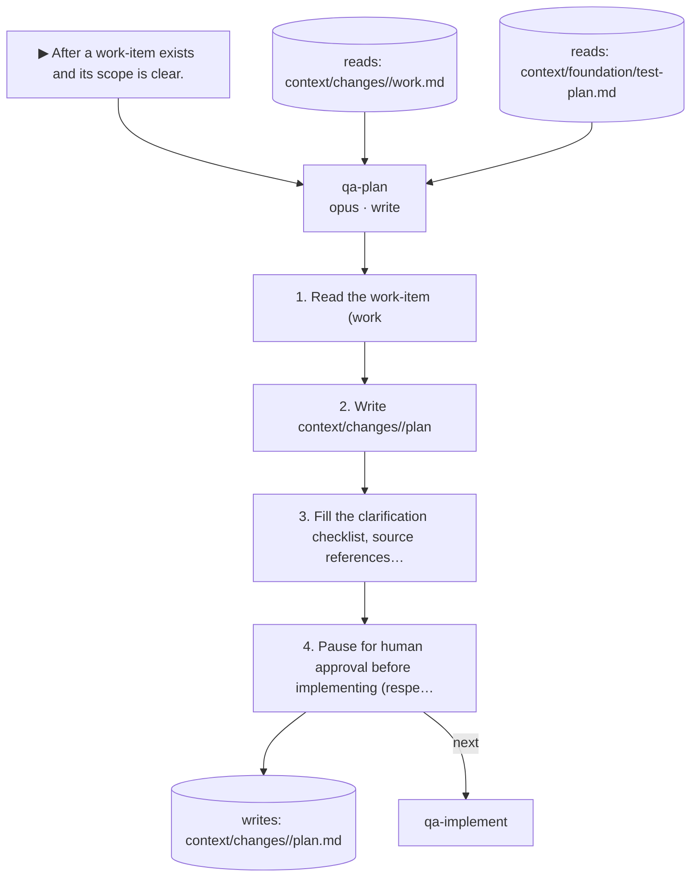
```mermaid
flowchart TD
  trig["▶ After a work-item exists and its scope is clear."]
  qa_plan["qa-plan<br/>opus · write"]
  trig --> qa_plan
  r0[("reads: context/changes/<work-id>/work.md")]
  r0 --> qa_plan
  r1[("reads: context/foundation/test-plan.md")]
  r1 --> qa_plan
  s0["1. Read the work-item (work"]
  qa_plan --> s0
  s1["2. Write context/changes/<work-id>/plan"]
  s0 --> s1
  s2["3. Fill the clarification checklist, source references…"]
  s1 --> s2
  s3["4. Pause for human approval before implementing (respe…"]
  s2 --> s3
  w0[("writes: context/changes/<work-id>/plan.md")]
  s3 --> w0
  s3 -->|next| qa_implement["qa-implement"]
```
<!-- @formatter:on -->

#### `qa-implement`

Execute an approved work-item plan step by step, keeping context/ current.

- **Model:** sonnet (balanced) · **Mode:** write
- **Reads:** `context/changes/<work-id>/plan.md`
- **Writes:** `context/changes/<work-id>/`
- **Next:** `qa-test-case-design` → `qa-automation-bootstrapper` → `qa-test-automate` → `qa-test-data-gen` → `qa-rca` → `qa-review`

<!-- @formatter:off -->
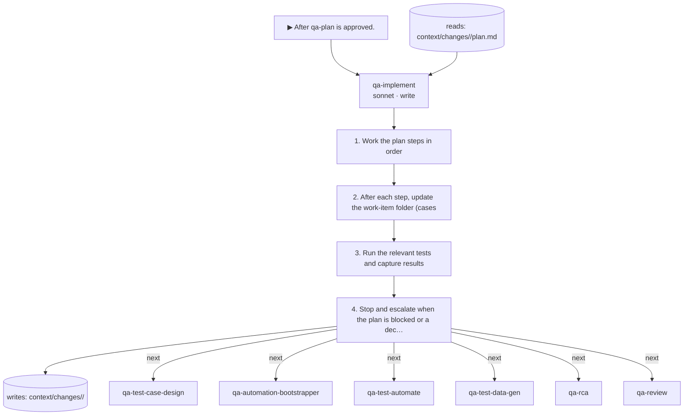
```mermaid
flowchart TD
  trig["▶ After qa-plan is approved."]
  qa_implement["qa-implement<br/>sonnet · write"]
  trig --> qa_implement
  r0[("reads: context/changes/<work-id>/plan.md")]
  r0 --> qa_implement
  s0["1. Work the plan steps in order"]
  qa_implement --> s0
  s1["2. After each step, update the work-item folder (cases"]
  s0 --> s1
  s2["3. Run the relevant tests and capture results"]
  s1 --> s2
  s3["4. Stop and escalate when the plan is blocked or a dec…"]
  s2 --> s3
  w0[("writes: context/changes/<work-id>/")]
  s3 --> w0
  s3 -->|next| qa_test_case_design["qa-test-case-design"]
  s3 -->|next| qa_automation_bootstrapper["qa-automation-bootstrapper"]
  s3 -->|next| qa_test_automate["qa-test-automate"]
  s3 -->|next| qa_test_data_gen["qa-test-data-gen"]
  s3 -->|next| qa_rca["qa-rca"]
  s3 -->|next| qa_review["qa-review"]
```
<!-- @formatter:on -->

#### `qa-review` *(read-only)*

Review a finished work-item for coverage, quality, and traceability (read-only).

- **Model:** opus (heavy reasoning) · **Mode:** read-only
- **Reads:** `context/changes/<work-id>/`
- **Writes:** —
- **Next:** `qa-coverage-gap` → `qa-archive` → `qa-implement`

<!-- @formatter:off -->
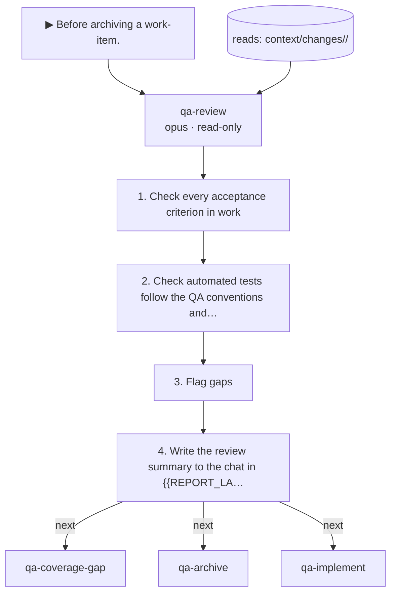
```mermaid
flowchart TD
  trig["▶ Before archiving a work-item."]
  qa_review["qa-review<br/>opus · read-only"]
  trig --> qa_review
  r0[("reads: context/changes/<work-id>/")]
  r0 --> qa_review
  s0["1. Check every acceptance criterion in work"]
  qa_review --> s0
  s1["2. Check automated tests follow the QA conventions and…"]
  s0 --> s1
  s2["3. Flag gaps"]
  s1 --> s2
  s3["4. Write the review summary to the chat in {{REPORT_LA…"]
  s2 --> s3
  s3 -->|next| qa_coverage_gap["qa-coverage-gap"]
  s3 -->|next| qa_archive["qa-archive"]
  s3 -->|next| qa_implement["qa-implement"]
```
<!-- @formatter:on -->

#### `qa-archive`

Close a reviewed work-item: capture lessons and move it to the read-only archive.

- **Model:** haiku (mechanical) · **Mode:** write
- **Reads:** `context/changes/<work-id>/`
- **Writes:** `context/archive/<work-id>/`, `context/foundation/lessons.md`, `context/foundation/tech-debt-tracker.md`
- **Next:** `qa-new` → `qa-gardening`

<!-- @formatter:off -->
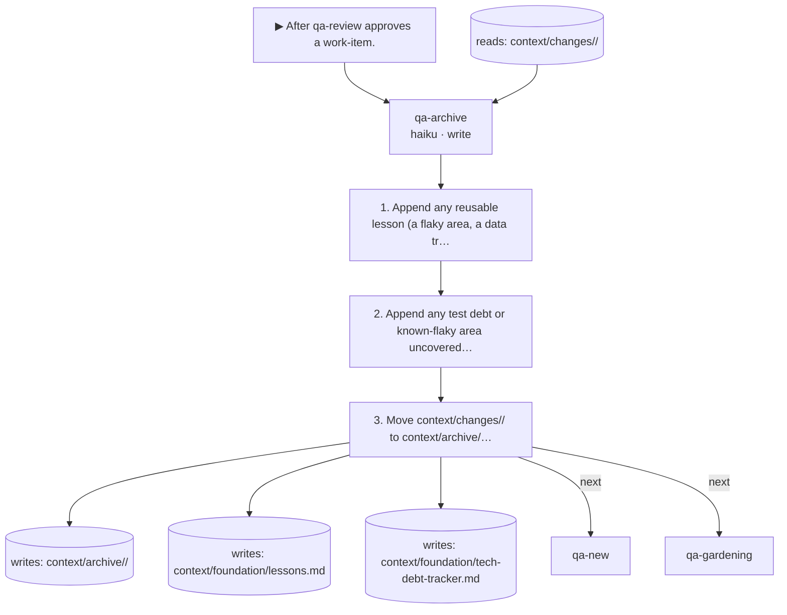
```mermaid
flowchart TD
  trig["▶ After qa-review approves a work-item."]
  qa_archive["qa-archive<br/>haiku · write"]
  trig --> qa_archive
  r0[("reads: context/changes/<work-id>/")]
  r0 --> qa_archive
  s0["1. Append any reusable lesson (a flaky area, a data tr…"]
  qa_archive --> s0
  s1["2. Append any test debt or known-flaky area uncovered…"]
  s0 --> s1
  s2["3. Move context/changes/<work-id>/ to context/archive/…"]
  s1 --> s2
  w0[("writes: context/archive/<work-id>/")]
  s2 --> w0
  w1[("writes: context/foundation/lessons.md")]
  s2 --> w1
  w2[("writes: context/foundation/tech-debt-tracker.md")]
  s2 --> w2
  s2 -->|next| qa_new["qa-new"]
  s2 -->|next| qa_gardening["qa-gardening"]
```
<!-- @formatter:on -->

### Test design

#### `qa-ticket-review`

Refine a ticket/requirement into a dual-output deliverable (canonical Markdown + paste-ready Jira) with testability, recommendations, and acceptance criteria.

- **Model:** opus (heavy reasoning) · **Mode:** write
- **Reads:** `context/foundation/test-strategy.md`, `context/reference/system-overview.md`
- **Writes:** `context/refinements/<YYYY-MM-DD>-<KEY>-<slug>.md`, `context/refinements/<YYYY-MM-DD>-<KEY>-<slug>.jira`
- **Next:** `qa-new` → `qa-test-plan` → `qa-test-case-design`

<!-- @formatter:off -->
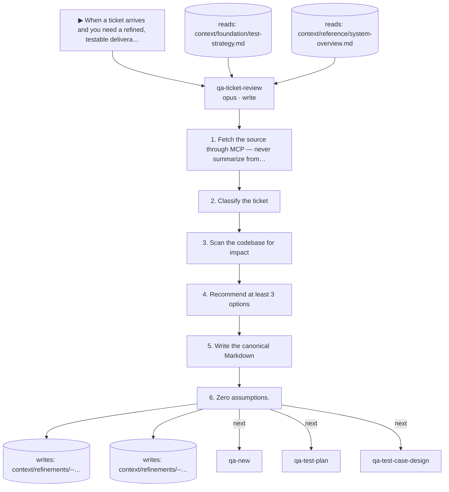
```mermaid
flowchart TD
  trig["▶ When a ticket arrives and you need a refined, testable delivera…"]
  qa_ticket_review["qa-ticket-review<br/>opus · write"]
  trig --> qa_ticket_review
  r0[("reads: context/foundation/test-strategy.md")]
  r0 --> qa_ticket_review
  r1[("reads: context/reference/system-overview.md")]
  r1 --> qa_ticket_review
  s0["1. Fetch the source through MCP — never summarize from…"]
  qa_ticket_review --> s0
  s1["2. Classify the ticket"]
  s0 --> s1
  s2["3. Scan the codebase for impact"]
  s1 --> s2
  s3["4. Recommend at least 3 options"]
  s2 --> s3
  s4["5. Write the canonical Markdown"]
  s3 --> s4
  s5["6. Zero assumptions."]
  s4 --> s5
  w0[("writes: context/refinements/<YYYY-MM-DD>-<KEY>-…")]
  s5 --> w0
  w1[("writes: context/refinements/<YYYY-MM-DD>-<KEY>-…")]
  s5 --> w1
  s5 -->|next| qa_new["qa-new"]
  s5 -->|next| qa_test_plan["qa-test-plan"]
  s5 -->|next| qa_test_case_design["qa-test-case-design"]
```
<!-- @formatter:on -->

#### `qa-test-plan`

Create or update the project's foundation test plan (strategy-level, durable).

- **Model:** sonnet (balanced) · **Mode:** write
- **Reads:** `context/foundation/test-strategy.md`
- **Writes:** `context/foundation/test-plan.md`
- **Next:** `qa-test-case-design`

<!-- @formatter:off -->
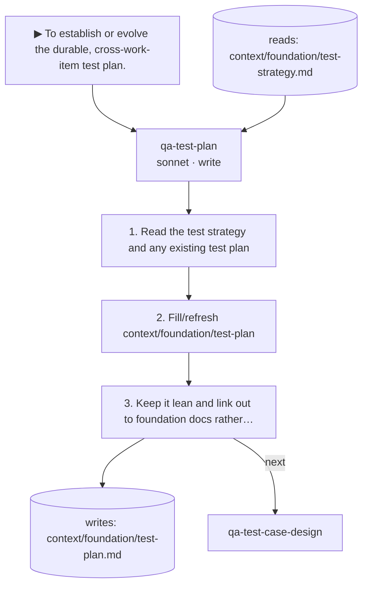
```mermaid
flowchart TD
  trig["▶ To establish or evolve the durable, cross-work-item test plan."]
  qa_test_plan["qa-test-plan<br/>sonnet · write"]
  trig --> qa_test_plan
  r0[("reads: context/foundation/test-strategy.md")]
  r0 --> qa_test_plan
  s0["1. Read the test strategy and any existing test plan"]
  qa_test_plan --> s0
  s1["2. Fill/refresh context/foundation/test-plan"]
  s0 --> s1
  s2["3. Keep it lean and link out to foundation docs rather…"]
  s1 --> s2
  w0[("writes: context/foundation/test-plan.md")]
  s2 --> w0
  s2 -->|next| qa_test_case_design["qa-test-case-design"]
```
<!-- @formatter:on -->

#### `qa-test-case-design`

Generate structured test cases for a work-item from its acceptance criteria.

- **Model:** opus (heavy reasoning) · **Mode:** write
- **Reads:** `context/changes/<work-id>/work.md`, `context/changes/<work-id>/plan.md`, `context/foundation/test-plan.md`
- **Writes:** `context/changes/<work-id>/cases.md`
- **Next:** `qa-test-data-gen` → `qa-test-automate` → `qa-coverage-gap`

<!-- @formatter:off -->
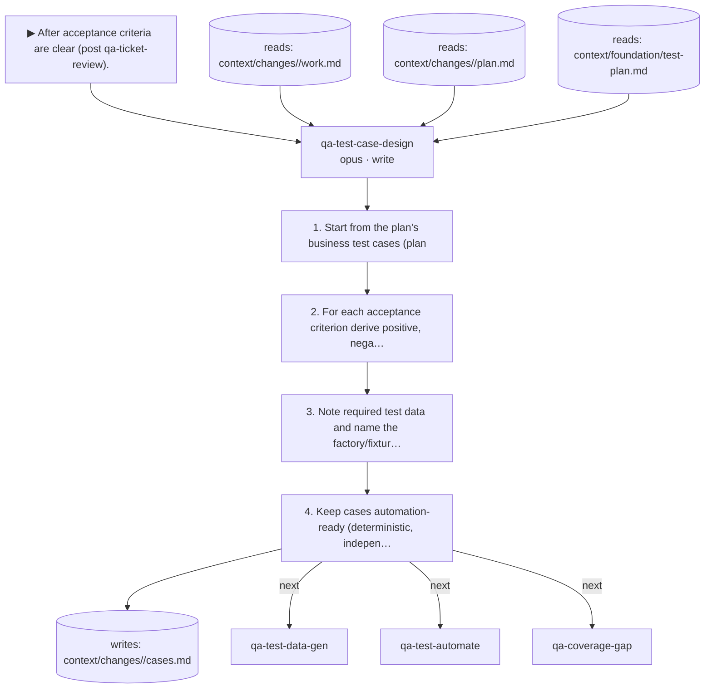
```mermaid
flowchart TD
  trig["▶ After acceptance criteria are clear (post qa-ticket-review)."]
  qa_test_case_design["qa-test-case-design<br/>opus · write"]
  trig --> qa_test_case_design
  r0[("reads: context/changes/<work-id>/work.md")]
  r0 --> qa_test_case_design
  r1[("reads: context/changes/<work-id>/plan.md")]
  r1 --> qa_test_case_design
  r2[("reads: context/foundation/test-plan.md")]
  r2 --> qa_test_case_design
  s0["1. Start from the plan's business test cases (plan"]
  qa_test_case_design --> s0
  s1["2. For each acceptance criterion derive positive, nega…"]
  s0 --> s1
  s2["3. Note required test data and name the factory/fixtur…"]
  s1 --> s2
  s3["4. Keep cases automation-ready (deterministic, indepen…"]
  s2 --> s3
  w0[("writes: context/changes/<work-id>/cases.md")]
  s3 --> w0
  s3 -->|next| qa_test_data_gen["qa-test-data-gen"]
  s3 -->|next| qa_test_automate["qa-test-automate"]
  s3 -->|next| qa_coverage_gap["qa-coverage-gap"]
```
<!-- @formatter:on -->

### Automation

#### `qa-automation-bootstrapper`

Set up the test-automation framework and wire result artifacts to be agent-readable.

- **Model:** sonnet (balanced) · **Mode:** write
- **Reads:** `context/.scaffold/manifest.json`, `context/foundation/tools.md`, `context/foundation/test-framework.md`
- **Writes:** `context/foundation/tools.md`, `context/foundation/test-framework.md`
- **Next:** `qa-test-automate` → `qa-ci-pipeline`

<!-- @formatter:off -->
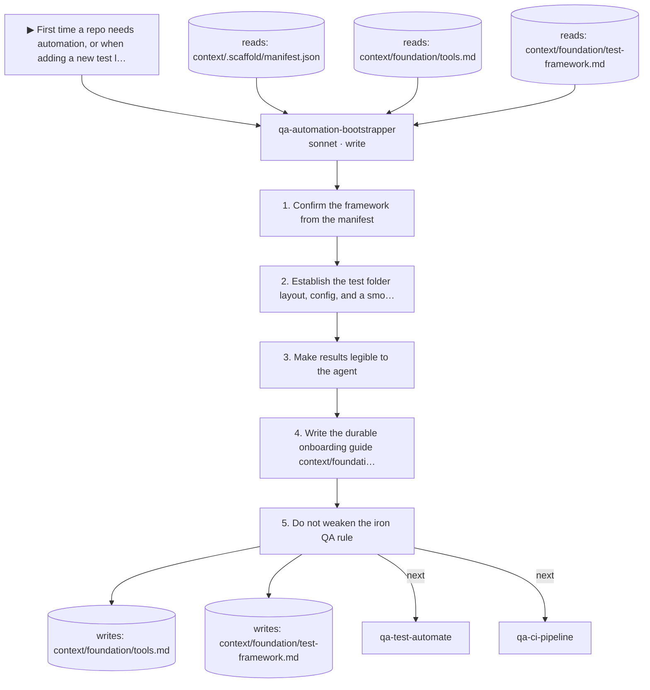
```mermaid
flowchart TD
  trig["▶ First time a repo needs automation, or when adding a new test l…"]
  qa_automation_bootstrapper["qa-automation-bootstrapper<br/>sonnet · write"]
  trig --> qa_automation_bootstrapper
  r0[("reads: context/.scaffold/manifest.json")]
  r0 --> qa_automation_bootstrapper
  r1[("reads: context/foundation/tools.md")]
  r1 --> qa_automation_bootstrapper
  r2[("reads: context/foundation/test-framework.md")]
  r2 --> qa_automation_bootstrapper
  s0["1. Confirm the framework from the manifest"]
  qa_automation_bootstrapper --> s0
  s1["2. Establish the test folder layout, config, and a smo…"]
  s0 --> s1
  s2["3. Make results legible to the agent"]
  s1 --> s2
  s3["4. Write the durable onboarding guide context/foundati…"]
  s2 --> s3
  s4["5. Do not weaken the iron QA rule"]
  s3 --> s4
  w0[("writes: context/foundation/tools.md")]
  s4 --> w0
  w1[("writes: context/foundation/test-framework.md")]
  s4 --> w1
  s4 -->|next| qa_test_automate["qa-test-automate"]
  s4 -->|next| qa_ci_pipeline["qa-ci-pipeline"]
```
<!-- @formatter:on -->

#### `qa-test-automate`

Author and maintain automated tests in the chosen framework from designed cases.

- **Model:** opus (heavy reasoning) · **Mode:** write
- **Reads:** `context/changes/<work-id>/cases.md`, `context/foundation/tools.md`
- **Writes:** `context/changes/<work-id>/automation.md`
- **Next:** `qa-rca` → `qa-playwright-cli` → `qa-performance` → `qa-ci-pipeline`

<!-- @formatter:off -->
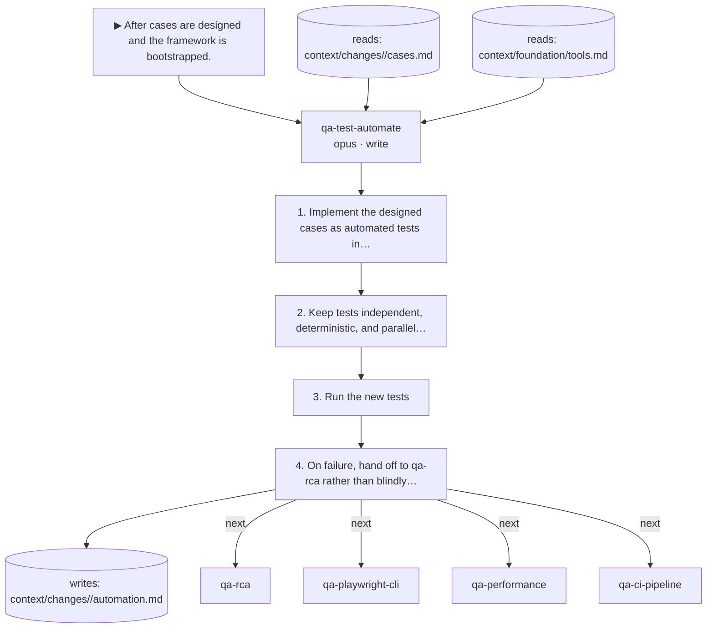
```mermaid
flowchart TD
  trig["▶ After cases are designed and the framework is bootstrapped."]
  qa_test_automate["qa-test-automate<br/>opus · write"]
  trig --> qa_test_automate
  r0[("reads: context/changes/<work-id>/cases.md")]
  r0 --> qa_test_automate
  r1[("reads: context/foundation/tools.md")]
  r1 --> qa_test_automate
  s0["1. Implement the designed cases as automated tests in…"]
  qa_test_automate --> s0
  s1["2. Keep tests independent, deterministic, and parallel…"]
  s0 --> s1
  s2["3. Run the new tests"]
  s1 --> s2
  s3["4. On failure, hand off to qa-rca rather than blindly…"]
  s2 --> s3
  w0[("writes: context/changes/<work-id>/automation.md")]
  s3 --> w0
  s3 -->|next| qa_rca["qa-rca"]
  s3 -->|next| qa_playwright_cli["qa-playwright-cli"]
  s3 -->|next| qa_performance["qa-performance"]
  s3 -->|next| qa_ci_pipeline["qa-ci-pipeline"]
```
<!-- @formatter:on -->

#### `qa-playwright-cli`

Drive the Playwright CLI (codegen, show-report, show-trace, --ui, --update-snapshots) to support test authoring and root-cause analysis.

- **Model:** sonnet (balanced) · **Mode:** write
- **Reads:** `context/changes/<work-id>/cases.md`, `context/foundation/tools.md`
- **Writes:** `context/changes/<work-id>/automation.md`
- **Next:** `qa-test-automate` → `qa-rca`

<!-- @formatter:off -->
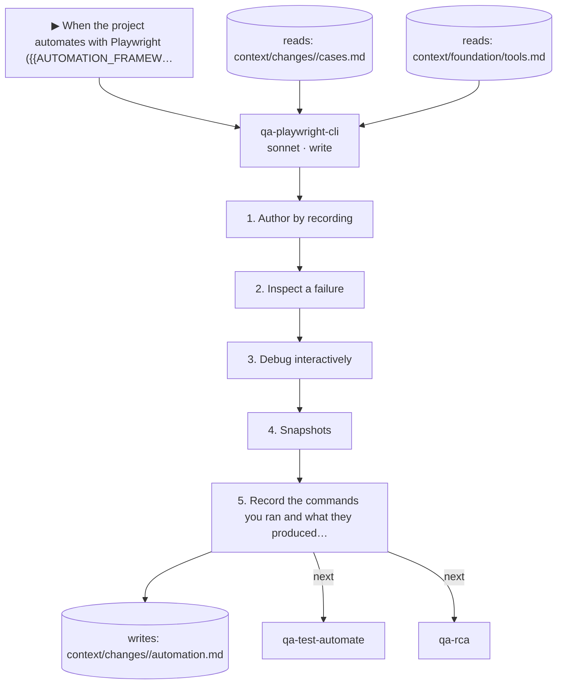
```mermaid
flowchart TD
  trig["▶ When the project automates with Playwright ({{AUTOMATION_FRAMEW…"]
  qa_playwright_cli["qa-playwright-cli<br/>sonnet · write"]
  trig --> qa_playwright_cli
  r0[("reads: context/changes/<work-id>/cases.md")]
  r0 --> qa_playwright_cli
  r1[("reads: context/foundation/tools.md")]
  r1 --> qa_playwright_cli
  s0["1. Author by recording"]
  qa_playwright_cli --> s0
  s1["2. Inspect a failure"]
  s0 --> s1
  s2["3. Debug interactively"]
  s1 --> s2
  s3["4. Snapshots"]
  s2 --> s3
  s4["5. Record the commands you ran and what they produced…"]
  s3 --> s4
  w0[("writes: context/changes/<work-id>/automation.md")]
  s4 --> w0
  s4 -->|next| qa_test_automate["qa-test-automate"]
  s4 -->|next| qa_rca["qa-rca"]
```
<!-- @formatter:on -->

#### `qa-ci-pipeline`

Generate or audit a CI pipeline that runs the chosen framework, publishes results into the report dirs wired into the result MCP, and runs `doctor` as a pull-request gate.

- **Model:** sonnet (balanced) · **Mode:** write
- **Reads:** `context/.scaffold/manifest.json`, `context/foundation/tools.md`
- **Writes:** `context/foundation/tools.md`, `.github/workflows/qa.yml (or .gitlab-ci.yml / azure-pipelines.yml)`
- **Next:** `qa-metrics` → `qa-rca` → `qa-performance`

<!-- @formatter:off -->
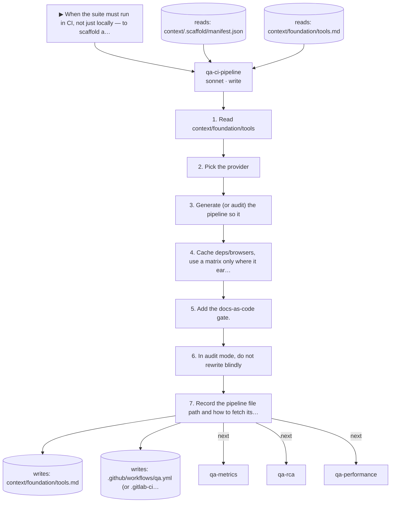
```mermaid
flowchart TD
  trig["▶ When the suite must run in CI, not just locally — to scaffold a…"]
  qa_ci_pipeline["qa-ci-pipeline<br/>sonnet · write"]
  trig --> qa_ci_pipeline
  r0[("reads: context/.scaffold/manifest.json")]
  r0 --> qa_ci_pipeline
  r1[("reads: context/foundation/tools.md")]
  r1 --> qa_ci_pipeline
  s0["1. Read context/foundation/tools"]
  qa_ci_pipeline --> s0
  s1["2. Pick the provider"]
  s0 --> s1
  s2["3. Generate (or audit) the pipeline so it"]
  s1 --> s2
  s3["4. Cache deps/browsers, use a matrix only where it ear…"]
  s2 --> s3
  s4["5. Add the docs-as-code gate."]
  s3 --> s4
  s5["6. In audit mode, do not rewrite blindly"]
  s4 --> s5
  s6["7. Record the pipeline file path and how to fetch its…"]
  s5 --> s6
  w0[("writes: context/foundation/tools.md")]
  s6 --> w0
  w1[("writes: .github/workflows/qa.yml (or .gitlab-ci…")]
  s6 --> w1
  s6 -->|next| qa_metrics["qa-metrics"]
  s6 -->|next| qa_rca["qa-rca"]
  s6 -->|next| qa_performance["qa-performance"]
```
<!-- @formatter:on -->

#### `qa-performance`

Generate or audit a JMeter load/performance test plan that enforces NFRs (p95/p99, throughput, error-rate), run it headless, and trace every performance case to an NFR.

- **Model:** sonnet (balanced) · **Mode:** write
- **Reads:** `context/foundation/test-plan.md`, `context/foundation/tools.md`, `context/changes/<work-id>/work.md`
- **Writes:** `context/changes/<work-id>/performance.md`, `performance plan (.jmx)`
- **Next:** `qa-ci-pipeline` → `qa-rca` → `qa-metrics`

<!-- @formatter:off -->
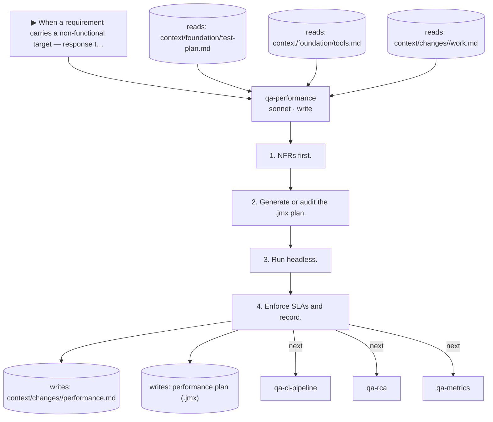
```mermaid
flowchart TD
  trig["▶ When a requirement carries a non-functional target — response t…"]
  qa_performance["qa-performance<br/>sonnet · write"]
  trig --> qa_performance
  r0[("reads: context/foundation/test-plan.md")]
  r0 --> qa_performance
  r1[("reads: context/foundation/tools.md")]
  r1 --> qa_performance
  r2[("reads: context/changes/<work-id>/work.md")]
  r2 --> qa_performance
  s0["1. NFRs first."]
  qa_performance --> s0
  s1["2. Generate or audit the .jmx plan."]
  s0 --> s1
  s2["3. Run headless."]
  s1 --> s2
  s3["4. Enforce SLAs and record."]
  s2 --> s3
  w0[("writes: context/changes/<work-id>/performance.md")]
  s3 --> w0
  w1[("writes: performance plan (.jmx)")]
  s3 --> w1
  s3 -->|next| qa_ci_pipeline["qa-ci-pipeline"]
  s3 -->|next| qa_rca["qa-rca"]
  s3 -->|next| qa_metrics["qa-metrics"]
```
<!-- @formatter:on -->

### Analysis & data

#### `qa-rca` *(read-only)*

Root-cause a failing test run or bug from artifacts, without changing code (read-only).

- **Model:** opus (heavy reasoning) · **Mode:** read-only
- **Reads:** `context/foundation/tools.md`, `context/changes/<work-id>/automation.md`
- **Writes:** —
- **Next:** `qa-test-automate` → `qa-bug-report`

<!-- @formatter:off -->
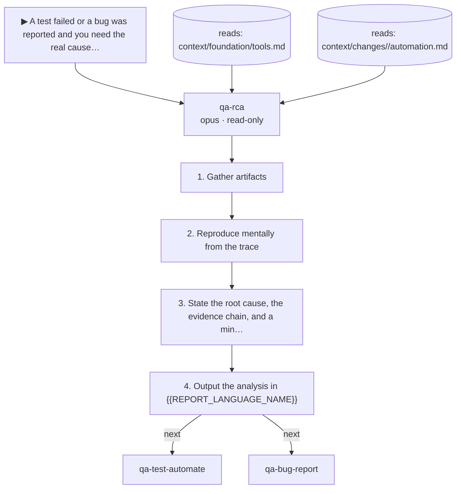
```mermaid
flowchart TD
  trig["▶ A test failed or a bug was reported and you need the real cause…"]
  qa_rca["qa-rca<br/>opus · read-only"]
  trig --> qa_rca
  r0[("reads: context/foundation/tools.md")]
  r0 --> qa_rca
  r1[("reads: context/changes/<work-id>/automation.md")]
  r1 --> qa_rca
  s0["1. Gather artifacts"]
  qa_rca --> s0
  s1["2. Reproduce mentally from the trace"]
  s0 --> s1
  s2["3. State the root cause, the evidence chain, and a min…"]
  s1 --> s2
  s3["4. Output the analysis in {{REPORT_LANGUAGE_NAME}}"]
  s2 --> s3
  s3 -->|next| qa_test_automate["qa-test-automate"]
  s3 -->|next| qa_bug_report["qa-bug-report"]
```
<!-- @formatter:on -->

#### `qa-test-data-gen`

Produce test data for designed cases, matching schema and edge conditions.

- **Model:** sonnet (balanced) · **Mode:** write
- **Reads:** `context/changes/<work-id>/cases.md`, `context/foundation/environments.md`
- **Writes:** `context/changes/<work-id>/`
- **Next:** `qa-test-automate` → `qa-coverage-gap`

<!-- @formatter:off -->
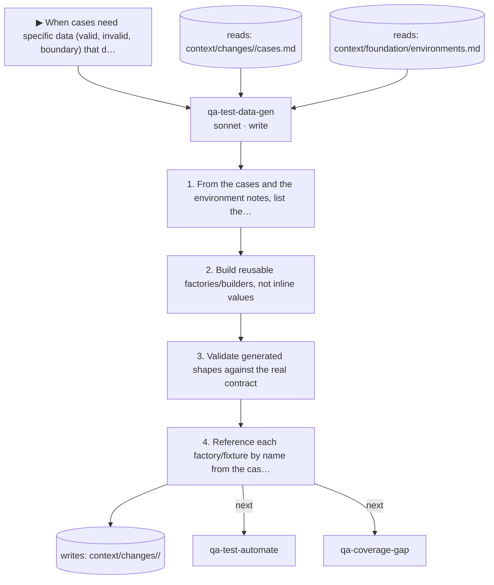
```mermaid
flowchart TD
  trig["▶ When cases need specific data (valid, invalid, boundary) that d…"]
  qa_test_data_gen["qa-test-data-gen<br/>sonnet · write"]
  trig --> qa_test_data_gen
  r0[("reads: context/changes/<work-id>/cases.md")]
  r0 --> qa_test_data_gen
  r1[("reads: context/foundation/environments.md")]
  r1 --> qa_test_data_gen
  s0["1. From the cases and the environment notes, list the…"]
  qa_test_data_gen --> s0
  s1["2. Build reusable factories/builders, not inline values"]
  s0 --> s1
  s2["3. Validate generated shapes against the real contract"]
  s1 --> s2
  s3["4. Reference each factory/fixture by name from the cas…"]
  s2 --> s3
  w0[("writes: context/changes/<work-id>/")]
  s3 --> w0
  s3 -->|next| qa_test_automate["qa-test-automate"]
  s3 -->|next| qa_coverage_gap["qa-coverage-gap"]
```
<!-- @formatter:on -->

#### `qa-gardening` *(read-only)*

Recurring read-only, LLM-driven sweep for semantic QA drift/slop across context/ and tests; proposes and delegates targeted fixes, never edits — the in-agent-loop complement to the deterministic doctor command.

- **Model:** sonnet (balanced) · **Mode:** read-only
- **Reads:** `context/foundation/`, `context/changes/`, `context/archive/`
- **Writes:** —
- **Next:** `qa-archive` → `qa-test-automate` → `qa-test-case-design` → `qa-test-plan`

<!-- @formatter:off -->
```mermaid
flowchart TD
  trig["▶ Run on a cadence (end of a sprint, before a release) to fight e…"]
  qa_gardening["qa-gardening<br/>sonnet · read-only"]
  trig --> qa_gardening
  r0[("reads: context/foundation/")]
  r0 --> qa_gardening
  r1[("reads: context/changes/")]
  r1 --> qa_gardening
  r2[("reads: context/archive/")]
  r2 --> qa_gardening
  s0["1. Start from deterministic signals"]
  qa_gardening --> s0
  s1["2. Scan the system of record for drift and staleness"]
  s0 --> s1
  s2["3. Apply the golden rules and flag each violation"]
  s1 --> s2
  s3["4. Output a prioritized fix list in {{REPORT_LANGUAGE_…"]
  s2 --> s3
  s3 -->|next| qa_archive["qa-archive"]
  s3 -->|next| qa_test_automate["qa-test-automate"]
  s3 -->|next| qa_test_case_design["qa-test-case-design"]
  s3 -->|next| qa_test_plan["qa-test-plan"]
```
<!-- @formatter:on -->

#### `qa-coverage-gap` *(read-only)*

Map acceptance criteria → test cases → automated tests and report uncovered criteria (read-only).

- **Model:** opus (heavy reasoning) · **Mode:** read-only
- **Reads:** `context/changes/<work-id>/work.md`, `context/changes/<work-id>/cases.md`, `context/changes/<work-id>/automation.md`, `context/foundation/test-plan.md`
- **Writes:** —
- **Next:** `qa-test-case-design` → `qa-test-automate` → `qa-review`

<!-- @formatter:off -->
```mermaid
flowchart TD
  trig["▶ When you need to know what is not covered: which acceptance cri…"]
  qa_coverage_gap["qa-coverage-gap<br/>opus · read-only"]
  trig --> qa_coverage_gap
  r0[("reads: context/changes/<work-id>/work.md")]
  r0 --> qa_coverage_gap
  r1[("reads: context/changes/<work-id>/cases.md")]
  r1 --> qa_coverage_gap
  r2[("reads: context/changes/<work-id>/automation.md")]
  r2 --> qa_coverage_gap
  r3[("reads: context/foundation/test-plan.md")]
  r3 --> qa_coverage_gap
  s0["1. Read the acceptance criteria from context/changes/<…"]
  qa_coverage_gap --> s0
  s1["2. Read context/changes/<work-id>/cases"]
  s0 --> s1
  s2["3. Read context/changes/<work-id>/automation"]
  s1 --> s2
  s3["4. Build the AC ↔ case ↔ test traceability table and c…"]
  s2 --> s3
  s4["5. Output a coverage-gap report in {{REPORT_LANGUAGE_N…"]
  s3 --> s4
  s4 -->|next| qa_test_case_design["qa-test-case-design"]
  s4 -->|next| qa_test_automate["qa-test-automate"]
  s4 -->|next| qa_review["qa-review"]
```
<!-- @formatter:on -->

#### `qa-metrics` *(read-only)*

Aggregate pass/fail/flakiness and acceptance-criterion coverage from the result MCP servers and context/ into a read-only QA metrics digest.

- **Model:** sonnet (balanced) · **Mode:** read-only
- **Reads:** `context/changes/`, `context/archive/`, `context/foundation/tech-debt-tracker.md`, `context/foundation/lessons.md`
- **Writes:** —
- **Next:** `qa-coverage-gap` → `qa-rca` → `qa-gardening`

<!-- @formatter:off -->
```mermaid
flowchart TD
  trig["▶ On a cadence (sprint end, before a release, after a CI run) to…"]
  qa_metrics["qa-metrics<br/>sonnet · read-only"]
  trig --> qa_metrics
  r0[("reads: context/changes/")]
  r0 --> qa_metrics
  r1[("reads: context/archive/")]
  r1 --> qa_metrics
  r2[("reads: context/foundation/tech-debt-tracker.md")]
  r2 --> qa_metrics
  r3[("reads: context/foundation/lessons.md")]
  r3 --> qa_metrics
  s0["1. Pull outcomes through the result MCP server (playwr…"]
  qa_metrics --> s0
  s1["2. Compute run metrics"]
  s0 --> s1
  s2["3. Compute criterion coverage across context/changes/…"]
  s1 --> s2
  s3["4. Emit a digest in {{REPORT_LANGUAGE_NAME}}"]
  s2 --> s3
  s3 -->|next| qa_coverage_gap["qa-coverage-gap"]
  s3 -->|next| qa_rca["qa-rca"]
  s3 -->|next| qa_gardening["qa-gardening"]
```
<!-- @formatter:on -->

#### `qa-bug-report`

Turn a confirmed product defect into a structured, reproducible bug report with evidence + a paste-ready Jira version.

- **Model:** sonnet (balanced) · **Mode:** write
- **Reads:** `context/changes/<work-id>/automation.md`, `context/changes/<work-id>/work.md`, `context/foundation/tools.md`
- **Writes:** `context/changes/<work-id>/bug-report.md`, `context/changes/<work-id>/bug-report.jira`
- **Next:** `qa-archive`

<!-- @formatter:off -->
```mermaid
flowchart TD
  trig["▶ After qa-rca concludes the failure is a product defect (not a t…"]
  qa_bug_report["qa-bug-report<br/>sonnet · write"]
  trig --> qa_bug_report
  r0[("reads: context/changes/<work-id>/automation.md")]
  r0 --> qa_bug_report
  r1[("reads: context/changes/<work-id>/work.md")]
  r1 --> qa_bug_report
  r2[("reads: context/foundation/tools.md")]
  r2 --> qa_bug_report
  s0["1. Pull the evidence through the result MCP server (pl…"]
  qa_bug_report --> s0
  s1["2. Confirm reproducibility"]
  s0 --> s1
  s2["3. Fill the template below into context/changes/<work-…"]
  s1 --> s2
  s3["4. Produce the paste-ready Jira version."]
  s2 --> s3
  s4["5. If an atlassian MCP server is configured, propose f…"]
  s3 --> s4
  w0[("writes: context/changes/<work-id>/bug-report.md")]
  s4 --> w0
  w1[("writes: context/changes/<work-id>/bug-report.ji…")]
  s4 --> w1
  s4 -->|next| qa_archive["qa-archive"]
```
<!-- @formatter:on -->

#### `qa-reverse-engineer`

Reverse-engineer the application source into structured project documentation under context/reference/ (read-only on code).

- **Model:** opus (heavy reasoning) · **Mode:** write
- **Reads:** `context/.scaffold/manifest.json`, `context/foundation/repo-map.md`
- **Writes:** `context/reference/`, `context/foundation/repo-map.md`
- **Next:** `qa-ticket-review` → `qa-test-plan` → `qa-gardening`

<!-- @formatter:off -->
```mermaid
flowchart TD
  trig["▶ To understand an existing application before planning tests, or…"]
  qa_reverse_engineer["qa-reverse-engineer<br/>opus · write"]
  trig --> qa_reverse_engineer
  r0[("reads: context/.scaffold/manifest.json")]
  r0 --> qa_reverse_engineer
  r1[("reads: context/foundation/repo-map.md")]
  r1 --> qa_reverse_engineer
  s0["1. Recon first"]
  qa_reverse_engineer --> s0
  s1["2. Read context/foundation/repo-map"]
  s0 --> s1
  s2["3. Propose the documentation structure before writing."]
  s1 --> s2
  s3["4. Document the architecture with the C4 model (see th…"]
  s2 --> s3
  s4["5. Each C4 level carries one Mermaid diagram (C4Contex…"]
  s3 --> s4
  s5["6. Enrich repo-map"]
  s4 --> s5
  s6["7. Link to real paths in the repo"]
  s5 --> s6
  w0[("writes: context/reference/")]
  s6 --> w0
  w1[("writes: context/foundation/repo-map.md")]
  s6 --> w1
  s6 -->|next| qa_ticket_review["qa-ticket-review"]
  s6 -->|next| qa_test_plan["qa-test-plan"]
  s6 -->|next| qa_gardening["qa-gardening"]
```
<!-- @formatter:on -->
